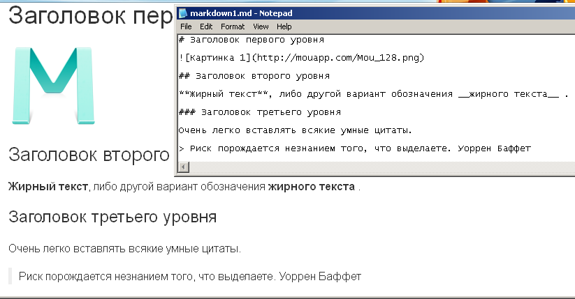
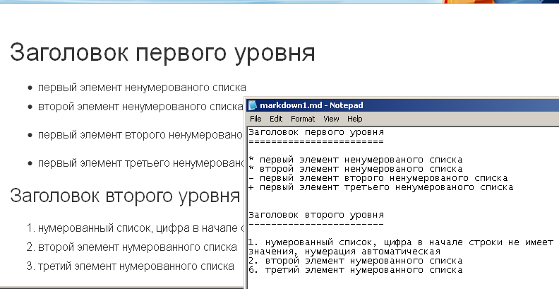
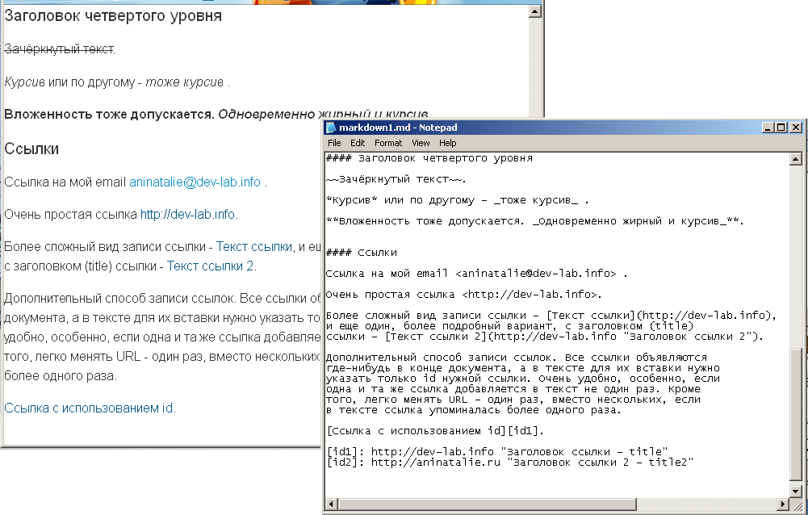
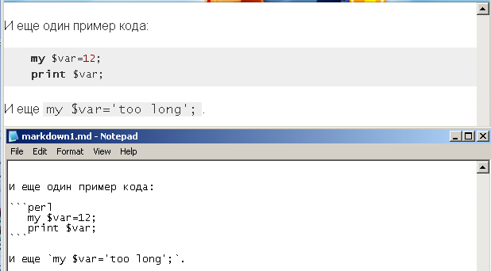
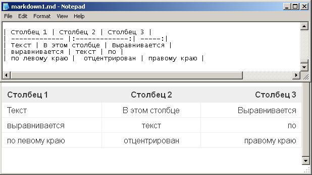

# Что такое Markdown

Markdown - это язык разметки, используется для форматирования простых текстов. Оформленный с помощью Markdown текст, легко конвертировать в HTML-код.

Если не хотите проблем с отображением русского текста при чтении md-документа, используйте UTF при написании.

## Немного о Markdown
Markdown создан в 2004 году Джоном Грубером и Аароном Шварцем. Цель создания - дать людям возможность создавать форматированный текст, который легко править и легко читать, а так же легко конвертировать в валидный HTML-код (или XHTML).

Markdown достаточно лаконичен, интуитивно понятен. Созданные с его помощью тексты действительно легко читать, даже в исходном виде, "как есть", еще до того как программа-просмотрщик отрисует заголовки, абзацы и таблицы. Markdown не доминирует в исходном тексте обилием тегов, как это свойственно HTML.

Грубер написал скрипт Markdown.pl (perl-скрипт), который конвертировал Markdown-текст в валидный HTML-код. Скрипт использовался как самостоятельный инструмент, и в качестве плагина к Blosxom, Movable Type, и как фильтр для BBEdit. Markdown так же реализован как perl-модуль Text::Markdown, доступный для скачивания на CPAN. Реализация на Perl распространяется под лицензией BSD-типа.

На данный момент доступны разнообразные реализации Markdown от сторонних разработчиков, в качестве модулей для всех популярных языков программирования, и плагинов для CMS-систем.

Markdown очень популярен, используется GitHub, GitBook, Reddit, Stack Overflow и многими другими проектами.

## Файлы
Файлы документов, при создании которых был использован язык разметки Markdown - должны иметь расширение ".md" .

Для создания документов достаточно обычного текстового редактора, с минимальным набором функций.

Для чтения Markdown-текста я использую удобный аддон для Firefox - Markdown Viewer.

## Заголовки
Markdown поддерживает два стиля оформления заголовков "setext" и "atx".

Setext-стиль предполагает, что заголовки первого уровня подчеркиваются символом "=", а заголовки второго уровня - символом "-".

Пример:
<pre>
This is an H1
=============
This is an H2
-------------
</pre>
Количество "подчеркивающих" символов может быть любым.



Atx-стиль предполагает использование от 1 до 6 символов "#" в начале заголовка. Количество символов обозначает уровень заголовка. Пример:
<pre>
# This is an H1
## This is an H2
###### This is an H6
</pre>

При желании, в заголовках atx-стиля можно использовать "закрывающий" тег.

"Закрывающие" теги используются только для красоты, на усмотрение создателя документа, поэтому, в нет необходимости ставить сопоставимое первому блоку количество символов "#". Количество "#" перед заголовком определяет уровень заголовка, но после заголовка их может быть произвольное число, начиная от нуля.

Впрочем, наверняка существуют ограничения по длине конвертером Markdown или иные системные ограничения.
<pre>
# This is an H1 #
## This is an H2 ##
### This is an H3 ######
</pre>

Правильный заголовок:
<pre>
# header1
</pre>

Правильный заголовок:
<pre>
Header
=======
</pre>

Неправильный заголовок (отсутствует пробел между символом "#" и текстом заголовка):
<pre>
#header1
</pre>

Неправильный заголовок (в заголовках такого типа разрешено использовать только символы "=" и "-"):
<pre>
Header
########
</pre>
## Внешний вид текста
Чтобы зачеркнуть текст, нужно использовать двойную тильду "~~".

Выделить текст курсивом можно с помощью одинарного символа "*" или "_". Выделение жирным шрифтом - "**" (двойная звездочка) или "__" (двойное подчеркивание).

Пример:
<pre>~~Зачёркнутый текст~~.</pre>
<pre>*Курсив* или по другому - _тоже курсив_ .</pre>
<pre>**Вложенность тоже допускается. _Одновременно жирный и курсив_**.</pre>

Чтобы добавить в текст маркированный список, нужно просто перечислить пункты списка, каждый пункт с новой строки, в начале строки символ "*", "-" или "+". В одном списке должны использоваться одинаковые маркеры. Изменение вида маркера приведет к тому, что при конвертации будет создано два разных списка.

Пример:
<pre>
* первый элемент ненумерованного списка
* второй элемент ненумерованного списка
- первый элемент второго ненумерованного списка
+ первый элемент третьего ненумерованного списка
</pre>



Для создания нумерованного списка, так же перечисляем пункты списка, каждый с новой строки. Вначале строки каждого пункта - число и следующая за ним точка. Интересно то, что нет необходимости соблюдать какой либо порядок в числах, если вы ошибетесь и после "2" напишете "9", при конвертации все равно будет автоматически соблюден правильный порядок чисел, и вместо "9" вы увидите значение "3".

Пример:
<pre>
1. Элемент нумерованного списка
2. Элемент №2 того же списка
9. Элемент №3 списка — элементы нумеруются по порядку, цифра в начале строки не имеет значения
</pre>

Добавить цитату (blockquote) можно с помощью символа "&gt;" в начале строки.
## Ссылки


Markdown поддерживает два вида ссылок: inline и reference. В обоих случаях текст ссылки ограничивается квадратными скобками.

Чтобы создать обычную (inline) ссылку, используйте квадратные и круглые скобки. В квадратных указывается текст ссылки, в круглых - URL. Можно добавить необязательный заголовок после URL.
<pre>
[Inline-style link](http://example.com/)
[Inline-style link with title](http://example.com/ "Link title")
</pre>

Reference-ссылки используют дополнительные квадратные скобки, внутри которого вы помещаете идентификатор ссылки. Идентификатор может быть как числом, так и строкой. Затем, в любом месте текста, вы сопоставляете идентификаторы ссылок и URL. Этот блок данных не будет отображаться при просмотре markdown-документа.
<pre>[Reference-style link][id]</pre>
<pre>[id]: http://example.com/ "Optional Title Here"
</pre>

Вы можете дополнительно использовать пробел для разделения разных групп скобок:
<pre>
This is [an example] [id] reference-style link.
</pre>

GitHub и GitBook (да и многие другие современные конвертеры) поддерживают автоматическую установку ссылок. Вам достаточно просто добавить в текст нужный URL, без всяких скобок.

Правильная ссылка:
<pre>
[Блог программиста](http://hypothetical-site.info)
</pre>
Неправильная ссылка (там где нужны квадратные скобки - используются круглые, и наоборот):
<pre>
(Блог программиста)[http://hypothetical-site.info]
</pre>
## Изображения
<pre>
# Inline

# Reference
![Alternative text][id]
[id]: url/to/image "Optional title"
</pre>

Форма добавления изображений очень похожа на добавление ссылок. Отличия:
<ul>
<li>квадратные скобки обязательно должны иметь префикс в виде восклицательного знака</li>
<li>внутри квадратных скобок может указываться некий альтернативный текст,
который будет отображен в случае невозможности загрузки изображения.</li>
</ul>
Пример:
<pre>

</pre>
<ul>
<li>Если окажется, что картинка не может быть загружена, пользователь увидит на экране надпись "Тут должна быть очень милая котейка".</li>
<li>Если картинка была успешно загружена, при наведении курсора мыши на картинку пользователь увидит надпись "Поделись с друзьями".</li>
</ul>
Правильно:
<pre>

</pre>

Неправильно (нет восклицательного знака):
<pre>
[My cat](http://hypothetical-site.info/cat.png)
</pre>
## Блоки кода
Вставка в документ блоков кода используется тогда, когда текст посвящен теме программирования и необходимо продемонстрировать большой или не очень кусок кода. Поскольку, Markdown-форматирование используется преимущественно в теме ИТ, потребность вставки и выделения блоков кода - одна из самых первостепенных.

Чтобы добавить блок кода в документ, можно использовать отступы. Каждая строка блока кода должна начинаться минимум с 4х пробелов или 1 символа табуляции. Данный способ поддерживается не всеми реализациями Markdown-просмотрщиков.

Надежнее вставить блок кода в документ с помощью тройного обратного апострофа. Тройной обратный апостроф используется как ограничитель, необходимо вставить строку с ними в начале и в конце блока кода.
<pre>```
   my $var=12;
   print $var;
```
</pre>
Чтобы добавить небольшой блок кода прямо в строку, можно использовать выделение с помощью одинарного символа обратного апострофа.
<pre>Объявляем новую переменную и присваиваем ей значение `my $var = 1;`.</pre>

### Синтаксическое выделение кода


Вы можете включить синтаксическую подсветку для куска кода, указав название
используемого языка программирования:
<pre>```perl
   my $var=12;
   print $var;
```
</pre>
### Таблицы


Таблицы не являются частью спецификации Markdown, но зато они поддерживаются в версиях GitHub Markdown и Markdown Here.
<pre>| Столбец 1 | Столбец 2 | Столбец 3 |
| ------------- |:-------------:| -----:|
| Текст | В этом столбце | Выравнивается |
| выравнивается | текст | по |
| по левому краю |  отцентрирован | правому краю |

</pre>
Для создания таблиц используются символы "|", "-" и ":". "|" обозначает столбцы. При этом, крайние символы "|" не обязательны. Символ двоеточия помогает определить выравнивание текста в столбцах.

<em>Заметка по мотивам вольного перевода "Learn Markdown" от Sammy P., Aaron O.</em>

