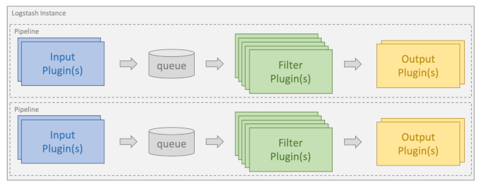
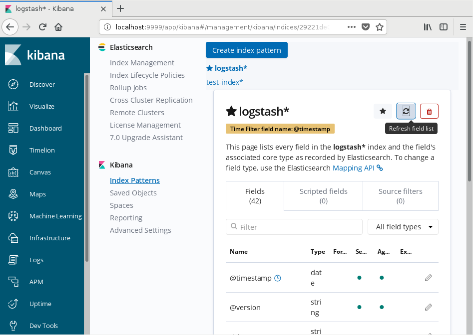
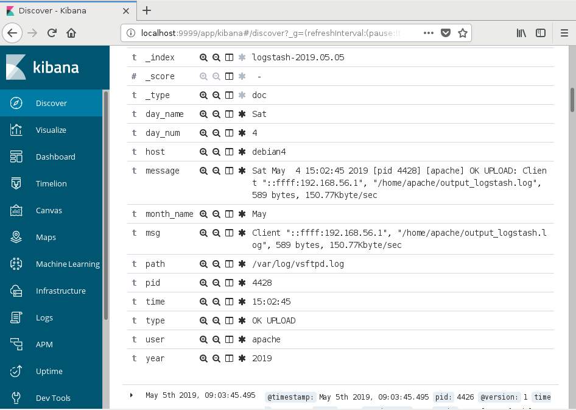

# Как добавлять логи в Elasticsearch с помощью Logstash

*Очень простой пример использования Logstash. В реальной жизни настройки системы будут намного сложнее.*

Logstash - это инструмент, который принимает на вход логи в различных форматах, обрабатывает их и отправляет на индексацию Elasticsearch.

*Чтобы после <a href="http://dev-lab.info/2019/04/%d1%83%d1%81%d1%82%d0%b0%d0%bd%d0%be%d0%b2%d0%ba%d0%b0-elasticsearch-logstash-%d0%b8-kibana-%d0%bf%d0%be%d0%b4-debian-linux/">установки Logstash</a> провести эксперимент по заливке данных в Elasticsearch, необходимы данные в больших объемах. К счастью, у каждого пользователя Linux есть логи в больших количествах - в директории /var/log/ . Вот их и будем индексировать.*

Обработка данных в Logstash организована по принципу конвейера и осуществляется с помощью плагинов. Любая информация проходит последовательно через цепочку плагинов. Конвееры Logstash создаются на основе одного или нескольких файлов конфигурации.

Плагины группируются по своему предназначению:
<ul>
<li><b>input</b> - входные плагины, отвечают за прием данных и отправку их в очередь на обработку;</li>
<li><b>filter</b> - фильтры, преобразуют данные, разбивают их на части;</li>
<li><b>output</b> - выходные плагины, отвечают за форматирование и доставку данных адресату (не обязательно Elasticsearch).</li>
</ul>

Logstash поставляется с большим набором плагинов.

Для обработки нового лога требуется создать новый конфигурационный файл и определить - какие плагины на каком этапе необходимо использовать.

Заготовка конфигурационного файла:
<pre>input {
...
}
filter {
}
output {
...
}
</pre>
Любая конфигурация Logstash должна определять как минимум один входной плагин и один выходной. Фильтры не являются обязательными.

## Конфигурация Logstash для вывода данных в файл

Для обработки я выбрала файл /var/log/vsftpd.log. Неприятной особенностью данного лога является разное содержимое и формат каждой строки:
<pre>Wed Apr  3 14:54:30 2019 [pid 20161] CONNECT: Client "::ffff:192.168.56.1"
Wed Apr  3 14:54:30 2019 [pid 20160] [apache] OK LOGIN: Client "::ffff:192.168.56.1"
Wed Apr  3 14:55:32 2019 [pid 20170] CONNECT: Client "::ffff:192.168.56.1"
Wed Apr  3 14:55:32 2019 [pid 20169] [apache] OK LOGIN: Client "::ffff:192.168.56.1"
Wed Apr  3 14:55:35 2019 [pid 20171] [apache] OK DOWNLOAD: Client "::ffff:192.168.56.1", "/home/apache/Untitled.xml", 9015 bytes, 2463.27Kbyte/sec
...
</pre>
В директории /etc/logstash/conf.d/ создаем файл test.conf:
<pre>input {
  file {
    path =&gt; [ "/var/log/vsftpd.log" ]
    sincedb_path =&gt; "/dev/null"
    start_position =&gt; "beginning"
  }
}

filter {
  dissect {
    mapping =&gt; {
      "message" =&gt; "%{day_name} %{month_name}  %{day_num} %{time} %{year} [pid %{pid}] %{type}: %{msg}"
    }
  }
  if [type] != "CONNECT" {
    dissect {
      mapping =&gt; {
        "type" =&gt; "[%{user}] %{type}"
      }
    }
  }
}

output {
  file {
    path =&gt; "/home/apache/output_logstash.log"
    codec =&gt; "json"
  }
}
</pre>
Благодаря приведенному конфигу, Logstash прочитает данные из файла /var/log/vsftpd.log, разобьет каждую строку на пары "ключ"/"значение", и запишет получившиеся структуры данных в json-формате, в файл /home/apache/output_logstash.log .

Почему запись сделана не в Elasticsearch, а в простой текстовый файл? Потому, что так удобнее на этапе отладки блока filter. Составить удовлетворяющие шаблоны для парсинга строк лога может получится далеко не сразу. Удалить данные из текстового файла и запустить парсинг заново намного проще, чем почистить Elasticsearch.

Запускаем Logstash:
<pre>$ service logstash start
</pre>
После этого есть время на то, чтоб приготовить чашечку кофе - Logstash требуется время на запуск.

Открываем файл /home/apache/output_logstash.log:
<pre>{
"day_num":"3",
"path":"/var/log/vsftpd.log",
"day_name":"Wed",
"year":"2019",
"type":"CONNECT",
"@timestamp":"2019-05-04T17:53:00.630Z",
"message":"Wed Apr  3 14:54:30 2019 [pid 20161] CONNECT: Client \"::ffff:192.168.56.1\"",
"host":"debian4",
"msg":"Client \"::ffff:192.168.56.1\"",
"@version":"1",
"month_name":"Apr",
"pid":"20161",
"time":"14:54:30"
}
{
"day_num":"3",
"path":"/var/log/vsftpd.log",
"day_name":"Wed",
"year":"2019",
"type":"OK LOGIN",
"@timestamp":"2019-05-04T17:53:00.727Z",
"user":"apache",
"message":"Wed Apr  3 14:54:30 2019 [pid 20160] [apache] OK LOGIN: Client \"::ffff:192.168.56.1\"",
"host":"debian4",
"msg":"Client \"::ffff:192.168.56.1\"",
"@version":"1",
"month_name":"Apr",
"pid":"20160",
"time":"14:54:30"
}
...
</pre>
Останавливаем Logstash:
<pre>$ service logstash stop
</pre>

## Конфигурация Logstash для отправки данных в Elasticsearch

Допустим, получившаяся структура данных нас устраивает и ошибок парсинга не случилось. Теперь изменим в конфиге /etc/logstash/conf.d/test.conf блок output:
<pre>output {
  elasticsearch { hosts =&gt; [ "localhost:9200" ] }
#  file {
#    path =&gt; "/home/apache/output_logstash.log"
#    codec =&gt; "json"
#  }
}
</pre>
Запускаем все необходимые сервисы:
<pre>$ service elasticsearch start
$ service kibana start
</pre>
Позволяем этим сервисам загрузиться, ждем некоторое время. Запускаем Logstash. После того, как Logstash загрузится, он распарсит данные по уже отлаженному нами шаблону, но запишет результат не в файл, а передаст на индексацию Elasticsearch.

В браузере вводим адрес http://localhost:9999/app/kibana . Переходим на страницу "Management". Далее пункты меню "Kibana" -&gt; "Index Patterns" и нажимаем кнопку "Refresh field list".

Теперь можно попробовать просмотреть результаты работы Logstash. Переходим на страницу "Discover":

Если Kibana пишет, что никаких данных не найдено ("No results match your search criteria"), попробуйте изменить временной интервал, указанный в правом верхнем углу страницы. По умолчанию, Kibana показывает данные, которые были добавлены за последние 15 минут.

Разворачиваем данные для просмотра:

## Дополнительные комментарии к конфигурационному файлу Logstash

### Конфигурирование блока input
<pre>input {
  file {
    path =&gt; [ "/var/log/vsftpd.log" ]
    sincedb_path =&gt; "/dev/null"
    start_position =&gt; "beginning"
  }
}
</pre>
Input-плагин позволяет Logstash прочитать данные из определенного источника. В указанном примере, данные запрашиваются из файла /var/log/vsftpd.log и используется плагин "file".

Деректива <b>start_position</b>, возможные значения: beginning, end (по умолчанию). Определяет, с какой позиции читать данные при обнаружении нового файла, с начала или с конца. Если мы работаем со старыми данными, устанавливаем "beginning". Если в режиме реального времени отслеживаем добавление новых данных в файл - то "end". Директива имеет значение только при самом первом обнаружении файла. При каждом прохождении Logstash начнет сохранять текущую позицию в файле sincedb, и в дальнейшем начинать просмотр именно с нее.

Директива <b>sincedb_path</b> - путь к файлу базы данных sincedb. Logstash использует sincedb для записи информации о текущей позиции читаемого файла. Т.к. при отладке конфига нам требуется многократное прохождение одного и того же файла, предлагаем Logstash писать данные о текущей позиции в /dev/null.

Для пользователя доступен достаточно большой список input-плагинов, вот самые полезные и часто используемые:
<ul>
<li>beats - позволяет получать данные, отправленные агентами Elastic Beats;</li>
<li>file - читает данные из файла;</li>
<li>rabbitmq - получает данные от RabbitMQ exchange;</li>
<li>redis - читает данные из Redis;</li>
<li>sqlite - получает данные из базы данных SQLite;</li>
<li>syslog - прослушивает порт 514 на предмет появления новых сообщений syslog и анализирует их в соответствии со стандартом RFC3164;</li>
<li>twitter - читает данные из Twitter Streaming API.</li>
</ul>
<a href="https://www.elastic.co/guide/en/logstash/current/input-plugins.html" rel="nofollow">elastic.co: Полный список Input-плагинов для текущей версии Logstash</a>. Там же ссылки на параметры настройки каждого плагина.

### Конфигурирование блока fliter

<pre>filter {
  dissect {
    mapping =&gt; {
      "message" =&gt; "%{day_name} %{month_name}  %{day_num} %{time} %{year} [pid %{pid}] %{type}: %{msg}"
    }
  }
  if [type] != "CONNECT" {
    dissect {
      mapping =&gt; {
        "type" =&gt; "[%{user}] %{type}"
      }
    }
  }
}
</pre>
Фильтры выполняют промежуточную обработку данных. Можно использовать условное применение фильтров,
в зависимости от характеристик входящих данных.

#### Использование фильтра dissect

Фильтр Dissect - это своеобразная операция "split". Отличается тем, что в обычных "split"-функциях - указывается один разделитель, который применяется ко всей строке, а Dissect - задает шаблон строки с разделителями и набором полей. Dissect не использует регулярные выражения, работает быстро. Если текст от строки к строке слишком отличается, возможно, стоит использовать другой фильтр - Grok. Возможно так же комбинированое использование: сначала к строке применяется Dissect, затем Grok.

Директива <b>mapping</b> - содержит список полей "ключ"/"значение", где ключ - это название поля, содержимое которого предлагается разбить на части, а значение - это шаблон, по которому это будет выполняться.

Разбиение строки выполняется слева направо. Выполняется с помощью специальных %{} блоков. Внутри блока указывается имя будущего поля. Все, что находится между блоками %{} - будет являться разделителями.

При разборе строки текст захватывается до первого разделителя - этот захваченный текст сохраняется в первом поле. Операция повторяется для каждой пары "блок %{}"-"разделитель" до тех пор, пока не будет достигнут последний разделитель. Оставшийся текст будет сохранен в последнем поле, заданном с помощью %{}.

Для разбора строки из лога:
<pre>Wed Apr  3 14:54:30 2019 [pid 20161] CONNECT: Client "::ffff:192.168.56.1"
</pre>
использовался следующий шаблон:
<pre>%{day_name} %{month_name}  %{day_num} %{time} %{year} [pid %{pid}] %{type}: %{msg}
</pre>
Первый разделитель - одиночный пробел, все символы, которые встретятся до первого попавшегося одиночного пробела будут выделены в поле с именем day_name. Следующий разделитель - тройной пробел, все символы, которые будут найдены в промежутке между одиночным пробелом и тройным - будут выделены в отдельное поле под названием "month_name", и так далее. Последним разделителем в данном шаблоне является сочетание символов ": ", весь найденный текст после этого разделителя будет помещен в поле с именем %{msg}. Кстати, после того, как поля выделены и содержат значения, их можно снова пропустить через какой-нибудь фильтр для дополнительной обработки - я так и сделала для поля "type".

Блоки <em>%{}</em> могут содержать специальные префиксы перед именем поля: "?", "+", "&amp;" или суффикс "/num".
<pre>"%{field_name1} %{+field_name1} %{+field_name1} %{src} %{}: %{msg}"</pre>
<ul>
<li><em>%{}</em> - пустое поле, пропускаем, сохранять не требуется. Формат шаблона требует, чтоб был указан каждый разделитель, но что если в строке встречается переменное значение, которое нельзя указать заранее?</li>
<li><em>%{?foo}</em> - именованное поле.</li>
<li><em>%{field_name1} %{+field_name1}</em> - "+field_name1" значение этого поля добавляется к значению уже существующего поля "field_name1"</li>
<li>Модификатор <em>/digits</em> позволяет изменить порядок добавления значения к полю. Например, для текста "1 2 3 go", применим шаблон "%{+a/2} %{+a/1} %{+a/4} %{+a/3}" и получим ключ с именем "a" и значением "2 1 go 3". Если модификатор порядка не использовался, значения будут добавляться в порядке нахождения.</li>
<li><em>%{&amp;some_field}</em> - позволяет использовать в качестве имени ключа значение другого поля. Например, для текста "error: some_error, some_description" применим шаблон "error: %{?err}, %{&amp;err}" и получим пару "ключ"/"значение": "some_error" =&gt; "some_description".</li>
</ul>

Самые интересные фильтры Logstash:
<ul>
<li>dissect - разбирает текст и превращает его в структуру данных, работает по принципу "split";</li>
<li>drop - позволяет полностью удалить событие, структуру данных. Может быть полезно для удаления отладочных сообщений;</li>
<li>grok - разбирает текст и превращает его в структуру данных, работает по принципу регулярных выражений;</li>
<li>mutate - выполняет преобразования в полях структур данных, позволяет переименовывать поля, удалять, заменять и изменять их.</li>
</ul>

<a href="https://www.elastic.co/guide/en/logstash/current/filter-plugins.html" rel="nofollow">elastic.co: Полный список Filter-плагинов для текущей версии Logstash</a>

<a href="https://github.com/logstash-plugins/logstash-patterns-core/blob/master/patterns/grok-patterns" rel="nofollow">github.com: Список доступных паттернов для grok</a>

#### Конфигурирование блока output

<pre>output {
  file {
    path =&gt; "/home/apache/output_logstash.log"
    codec =&gt; "json"
  }
}
</pre>
Output-плагин отправляет обработанные данные в конкретный пункт назначения. Это завершающий этап в конвеере Logstash.

В приведенном примере используется плагин для вывода данных в файл. Директива <b>codec</b> - определяет, в каком формате сохранить данные.

<a href="https://www.elastic.co/guide/en/logstash/7.0/codec-plugins.html" rel="nofollow">elastic.co: Полный список кодеков для определения формата вывода данных</a>

Список самых полезных доступных Output-плагинов:
<ul>
<li>csv - сохраняет данные на диск в формате csv;</li>
<li>elasticsearch - отправляет данные Elasticsearch;</li>
<li>email - отправляет письмо на указанный адрес электронной почты;</li>
<li>file - пишет информацию в файл;</li>
<li>nagios - отправляет результаты пассивной проверки в Nagios;</li>
<li>redmine - создает новый тикет с помощью Redmine API.</li>
</ul>

<a href="https://www.elastic.co/guide/en/logstash/current/output-plugins.html" rel="nofollow">elastic.co: Полный список Output-плагинов для текущей версии Logstash</a>
