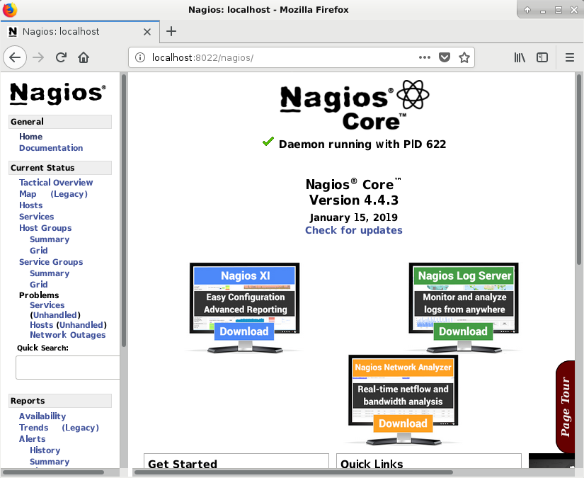

# Установка Nagios под Debian 9.x

*Частичный перевод инструкции <a href="https://support.nagios.com/kb/article/nagios-core-installing-nagios-core-from-source-96.html#Raspbian">support.nagios.com</a>, за исключением небольших комментариев относительно настройки web-интерфейса Nagios.*

Nagios – программное обеспечение для мониторинга сетей, серверов, приложений и сервисов. В случае сбоя Nagios отправляет уведомления администраторам системы.

Все шаги по установке Nagios в Debian требуют запуска от имени пользователя root.

Установка необходимых пакетов:
<pre>apt-get update
apt-get install -y autoconf gcc libc6 make wget unzip apache2 apache2-utils php libgd-dev
</pre>

Скачиваем Nagios:
<pre>cd /tmp
wget -O nagioscore.tar.gz https://github.com/NagiosEnterprises/nagioscore/archive/nagios-4.4.3.tar.gz
tar xzf nagioscore.tar.gz
</pre>

Компилируем:
<pre>cd /tmp/nagioscore-nagios-4.4.3/
./configure --with-httpd-conf=/etc/apache2/sites-enabled
make all
</pre>

Cоздаем пользователя и группу nagios. Пользователя www-data добавляем в группу nagios.
<pre>make install-groups-users
usermod -a -G nagios www-data
</pre>

Запускаем установку Nagios. Будут установлены бинарники, CGI и HTML-файлы:
<pre>make install</pre>

Устанавливаем:
<ul>
<li>файлы демона Nagios и настраиваем их для запуска при загрузке,</li>
<li>устанавливает и настраивает командный режим,</li>
<li>устанавливает файлы конфигурации, необходимые Nagios для работы,</li>
<li>устанавливает файлы конфигурации для Apache и подключаем дополнительные модули.</li>
</ul>

<pre>make install-daemoninit
make install-commandmode
make install-config
make install-webconf
a2enmod rewrite
a2enmod cgi
</pre>

**Iptables** - утилита, используется для управления системой **netfilter**. Netfilter встроен в ядро Linux.
**Iptables-persistent** - пакет, содержит iptables и ip6tables. Устанавливаем iptables-persistent:
<pre>apt-get install -y iptables-persistent</pre>

Создаем учетную запись пользователя nagiosadmin:
<pre>htpasswd -c /usr/local/nagios/etc/htpasswd.users nagiosadmin</pre>

По умолчанию, при установке Nagios предполагается, что для работы с web-интерфейсом будет использоваться порт 80. У меня указанный порт уже занят, поэтому дополнительно внесла изменения в конфиг <em>/etc/apache2/ports.conf</em>, слушать не порт 80, а 8022:
<pre>Listen 8022</pre>

Все остальные настройки без изменений.

Задаем файерволу новое правило:
<pre>iptables -A INPUT -p tcp --dport 8022 -j ACCEPT
iptables-save
</pre>

Запускаем сначала Apache, затем Nagios Core:
<pre>service apache2 start
service nagios start
</pre>

Выполним простую проверку работоспособности Nagios, в браузере укажем адрес *http://localhost:8022/nagios*. Если все
предыдущие шаги были выполнены успешно, сначала пользователю будет предложено ввести логин/пароль, затем загрузится
главная страница web-интерфейса:

Файлы Nagios (в т.ч. логи, конфиги) можно найти в директории */usr/local/nagios*.

