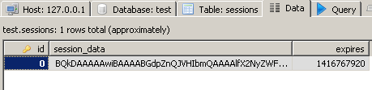

# Создание системы сессий, авторизации и аутентификации в Catalyst. Часть 1. Сессии в Catalyst

*Создание модели DBI в Catalyst. Использование DBI-модели. Реализация системы сессий в Catalyst, с помощью плагинов Catalyst::Plugin::Session::PerUser, Catalyst::Plugin::Session::Store::DBI, Catalyst::Plugin::Session::State::Cookie. Примеры кода, скриншоты.*

*Ввиду того, что VPS от REG.RU с некоторых пор убивает все процессы cpan на установку новых модулей, а новый хороший сервер для тестирования пока не найден, система авторизации разрабатывалась под Windows-окружением.*

<a href="Catalyst_Plugin_Session_2.md">Создание системы сессий, авторизации и аутентификации в Catalyst. Часть 2. Аутентификация и авторизация</a>

<a href="Catalyst_Plugin_Session_3.md">Создание системы сессий, авторизации и аутентификации в Catalyst. Часть 3. Роли пользователей</a>

## Создание модели DBI

**1.** Устанавливаем модуль Catalyst::Model::DBI

<pre>cpan install Catalyst::Model::DBI</pre>

**2.**Создаем модель для работы с mysql.

*lib/app/Model/DBI.pm*:
```perl
package app::Model::DBI;

use strict;
use base 'Catalyst::Model::DBI';
use VKino::Config;

__PACKAGE__->config(
    dsn           => 'DBI:mysql:dbname=test;host=localhost',
    username      => 'root',
    password      => '',
    options       => { AutoCommit => 1 },
    loglevel      => 1
);

1;
```

<font color="#00aa00">DBIx</font> было решено не использовать, т.к. в нагруженном проекте он не желателен, тормозит всю систему. Лучше даже не привыкать.

**3.** Создаем страничку, которая выведет хоть что-то из БД, чтобы проверить работоспособность модели.

*lib/app/Controller/Root.pm*:

```perl
sub index :Path :Args(0) {
    my ( $self, $c ) = @_;

    my $dbh = $c->model( 'DBI' )->dbh;

    my $articles = $dbh->selectall_arrayref( "select * from articles order by id", 
        { Slice => {} } );
    $c->stash( articles => $articles );
    $c->stash->{template} = 'index.tt';

    $c->forward('View::TT');
}
```

*root/src/index.tt*:

```html
[% FOREACH article = articles %]
  [% article.name %] - [% article.full %]
[% END %]
```


## Добавление сессий в Catalyst-приложение

**1.** Устанавливаем сессионные модули.

<pre>cpan
force install Catalyst::Plugin::Session::Store::DBI 
force install Catalyst::Plugin::Session::State::Cookie 
</pre>

**2.** Создаем таблицу в БД.

<pre>CREATE TABLE sessions (
    id           char(72) primary key,
    session_data text,
    expires      int(10)
);
</pre>

Сессия - это некоторый идентификатор и набор данных, индивидуальный для каждого пользователя. Она позволяет идентифицировать пользователя, не заставляя его вводить свой логин/пароль, и другие данные,
при переходе на каждую страницу. Идентификатор сессии передается пользователю, и при каждом запросе, браузер возвращает заданный ID, позволяя опознавать пользователя. Традиционно, со стороны клиента для хранения ID сессии используются Cookies.

Catalyst использует два типа плагинов для работы с сессиями:
<ol>
<li><font color="#00aa00">State</font> - отвечает за отправку ID сессии браузеру, получение ID от браузера, выясняет состояние сессии и т.п.</li>
<li><font color="#00aa00">Store</font> - отвечает за хранение сессионных данных на стороне сервера. Для хранения могут использоваться файлы, база данных, память.</li>
</ol>

Как только вы подключаете сессионные модули в Catalyst, аутентификационная система автоматически начинает их использовать. Данные сессии будут доступны через <font color="#00aa00">$c-&gt;session</font> . Для чтения и записи данных, можно использовать <font color="#00aa00">$c-&gt;session</font> как обычный хэш.

**3.** Редактируем файл <font color="#00aa00">lib/app.pm</font>, добавляем в список модули сессий и конфигурационные данные для хранения сессий со стороны сервера:

```perl
use Catalyst qw/
    Session
    Session::PerUser
    Session::Store::DBI
    Session::State::Cookie
/;

__PACKAGE__->config(
    'Plugin::Session' => {
        expires   => 3600,
        dbi_dsn   => 'DBI:mysql:dbname=test;host=localhost',
        dbi_user  => 'root',
        dbi_pass  => '',
        dbi_table => 'sessions',
        dbi_id_field => 'id',
        dbi_data_field => 'session_data',
        dbi_expires_field => 'expires',

    }
);
```

Для хранения сессий в приведенном примере был использован <font color="#00aa00">DBI</font> и база данных <font color="#00aa00">mysql</font>, но в реальных условиях нагруженных систем, это не лучший выбор. Существует множество плагинов Catalyst для хранения сессионных данных: <font color="#00aa00">Catalyst::Plugin::Session::Store::Redis</font>, <font color="#00aa00">Catalyst::Plugin::Session::Store::MongoDB</font>, <font color="#00aa00">Catalyst::Plugin::Session::Store::Memcached::Fast</font> и другие. При проектировании реальной системы лучше использовать <font color="#00aa00">Memcached</font>.

**4.** Создаем новый контроллер.

<pre>perl script/app_create.pl controller Auction</pre>

**5.** Проверяем работоспособность сессий.

*lib/app/Controller/Root.pm*:

```perl
sub index :Path :Args(0) {
    $c->session->{gift} = 1;
}
```

*lib/app/Controller/Auction.pm*:

```perl
sub index :Path :Args(0) {
    my ( $self, $c ) = @_;

    $c->stash->{gift} = $c->session->{gift};
    $c->stash->{template} = 'auction/index.tt';

    $c->forward('View::TT');
}
```

*root/src/auction/index.tt*:

```html
Auction list
[% gift %]
```

Запускаем сервер. Сначала заходим на страницу <font color="#00aa00">http://localhost:3000/</font> - на ней в нашу сессию будет добавлен флаг подарка, который мы сможем использовать позднее.

Затем идем на страницу <font color="#00aa00">http://localhost:3000/auction</font> - там будет выводиться флаг подарка, как демонстрация работы сессий.

В cookies браузера будет добавлено:


В БД появится новая запись:



