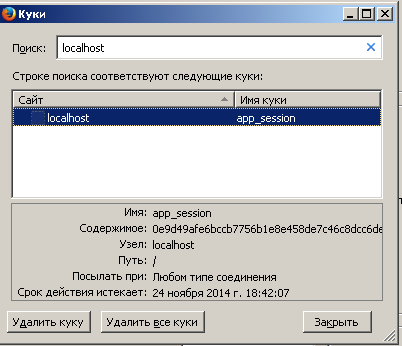
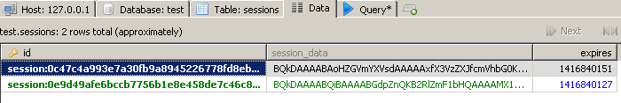

# Создание системы сессий, авторизации и аутентификации в Catalyst. Часть 2. Аутентификация и авторизация


*Аутентификация и авторизация пользователей в Catalyst-приложении. Аутентификация на основе
DBI. Работа с Catalyst::Authentication::Store::DBI::ButMaintained и Catalyst::Authentication::Credential::Password. Создание таблицы users в БД.*

<a href="Catalyst_Plugin_Session_1.md">Создание системы сессий, авторизации и аутентификации в Catalyst. Часть 1. Сессии в Catalyst</a>

<a href="Catalyst_Plugin_Session_3.md">Создание системы сессий, авторизации и аутентификации в Catalyst. Часть 3. Роли пользователей</a>

Ранее, в Catalyst-приложение была добавлена работа с сессиями. Однако, приведенные примеры кода еще не полностью работоспособны. Например, плагин <font color="#00aa00">Session::PerUser</font> позволяет использовать сессии не авторизовавшимся клиентам. Но при этом, для работы ему необходим <font color="#00aa00">плагин Authentication</font>. Session::PerUser использует его функции в своей работе. Таким образом, логическим продолжением работы с сессиями, является добавление в Catalyst-приложение системы аутентификации.

Наиболее часто встречающийся прием, это реализация аутентификации через DBIx и работу со схемами. Есть множество примеров реализации, для разных баз данных. Я решила не отступать от принятого решения и использовать <font color="#00aa00">DBI</font> (<font color="#00aa00">Catalyst::Model::DBI</font> работает через <font color="#00aa00">DBIx::Connector</font>). Это создало свои трудности. Оказалось, что аутентификация через DBI крайне редкий вариант, на который практически нет полных работающих примеров. Только небольшие отрывки кодов.

Так что, приведенный пример реализации - в некотором роде, уникальный.

**Что было сделано в процессе работы:**
<ul>
<li>создана страница входа в систему, выхода из системы,</li>
<li>регистрации нового пользователя,</li>
<li>добавлена страница профиля пользователя,</li>
<li>логины и пароли пользователей хранятся в БД mysql,</li>
<li>пароли шифруются MD5.</li>
</ul>
Все примеры приводятся с минимально возможным объемом кода, чтобы не отвлекаться от главного. Красивые стили, правильное форматирование html-страниц, обработка ошибок и исключений в коде - это можно сделать позднее. А пока - чистая реализация системы аутентификации.

## Введение

Логика работы с пользователями делится на 2 шага:
<ol>
<li><b>Аутентификация пользователя</b>. На этом шаге клиент должен подтвердить, что является тем, за кого себя выдает. Обычно для этого достаточно ввода логина и пароля. Возможна расширенная аутентификация, когда пользователь должен ответить на дополнительные вопросы. В сложных системах, связанных с финансами, могут быть дополнительные проверки, типа подтверждение по смс, использование электронных сертификатов для подтверждения своих прав, и т.п.</li>
<li><b>Авторизация</b>. Проверка прав конкретного пользователя на доступ к тем или иным данным. И предоставление этого доступа.</li>
</ol>

Для аутентификации пользователей используется плагин Catalyst - <font color="#00aa00">Plugin::Authentication</font> . Это основа для выстраивания системы аутентификации. Сам по себе плагин не является самодостаточным.

Настройки Plugin::Authentication делятся на две части.
<ul>
<li>Блок <b>Store</b> - используется для организации хранения информации о пользователе. Как и где будет храниться информация, определяет именно блок Store.</li>
<li>Блок <b>Credentials</b> - это механизм идентификации пользователей.</li>
</ul>
Пара Store и Credentials объединяются в "тип авторизации" - "realm". Таких типов для одного приложения может быть определено несколько штук. Например, в Catalyst-приложении используется авторизация с помощью соц.сетей. И каждый пользователь может выбрать, какую именно соц.сеть (Твиттер, Одноклассники, LiveJournal и т.п.) он хочет использовать для авторизации.

Плагин Plugin::Authentication сам не отвечает за работу с данными. И для Store, и для Credentials указывается специальный модуль, который будет реализовывать необходимую функциональность.

### Store

В качестве хранилища данных в моем случае используется БД mysql, а для работы с ней - DBI.

Чтобы заставить авторизацию работать через DBI, без схем, DBIx и прочего - пришлось постараться. Был найден специальный  модуль <font color="#00aa00">Catalyst::Authentication::Store::DBI::ButMaintained</font>.

<font color="#00aa00">Catalyst::Authentication::Store::DBI::ButMaintained</font> является форком от <font color="#00aa00">Catalyst::Authentication::Store::DBI</font>. Catalyst::Authentication::Store::DBI в настоящее время не поддерживается автором в работоспособном и актуальном состоянии, и попытка использовать его окончилась неудачей.

Главная задача модуля, который обслуживает раздел Store - обеспечить загрузку информации о пользователе, для ее дальнейшего использования.

### Credentials

Для верификации используется модуль <font color="#00aa00">Catalyst::Authentication::Credential::Password</font>, который входит в состав Plugin::Authentication и не требует отдельной установки.

<font color="#00aa00">Catalyst::Authentication::Credential::Password</font> в момент вызова метода <font color="#00aa00">$c-&gt;authenticate</font> получает данные о логине и пароле пользователя в качестве аргументов, и пытается сравнить их с данными из хранилища. Кроме того, пароль в БД хранится в зашифрованном состоянии. Catalyst::Authentication::Credential::Password способен работать с несколькими алгоритмами шифрования, поэтому от программиста не требуется шифровать пароли, прежде чем передать их методу $c-&gt;authenticate . Просто необходимо заранее указать в настройках используемый способ шифрования.

Кроме Catalyst::Authentication::Credential::Password часто используются модули <font color="#00aa00">Catalyst::Authentication::Credential::HTTP</font>, <font color="#00aa00">Catalyst::Authentication::Credential::OpenID</font>, <font color="#00aa00">Catalyst::Authentication::Credential::CAS</font> и др. Кроме того, никто не мешает вам самостоятельно написать подобный модуль. Если вы активно работаете с соц.сетями, вам, возможно, придется это сделать. Т.к. найти готовый модуль на cpan для авторизации под одной из местных соц.сетей - затруднительно.

**Примечание.** Слово "credentials" - сложно адекватно перевести на русский язык, особенно в IT-контексте. Ближе всего его значение, в текущем случае, к словосочетанию "учетные данные". В параметрах, которые прописываются для "credentials", указывается, какой "тип авторизации" будет использоваться. Т.е. Catalyst::Authentication::Credential::OpenID - использует для аутентификации пользователя технологию OpenID, а Catalyst::Authentication::Credential::CAS - технологию Central Authentication Service (CAS).

Самое главное, что придется сделать при написании собственного Credential-модуля - реализовать свой метод <font color="#00aa00">authenticate()</font>.

## Реализация системы аутентификации в Catalyst

**1.** Создаем таблицу в БД для хранения логинов и паролей пользователей.

<pre>CREATE TABLE users (id INT(11) NOT NULL AUTO_INCREMENT PRIMARY KEY, 
name CHAR(30), password TEXT, email TEXT, is_active BOOLEAN NOT NULL DEFAULT 1);
</pre>

**2.** Устанавливаем модуль
<pre>cpan force install Catalyst::Authentication::Store::DBI::ButMaintained</pre>

**3.** Создаем новый контроллер, для демонстрации работы системы аутентификации.
<pre>perl script/app_create.pl controller Profile</pre>

**4.** Добавляем в app.pm использование аутентификационного модуля и конфигурацию для него.

*lib/app.pm*:

```perl
use Catalyst qw/
    Authentication
    Session
    Session::PerUser
    Session::Store::DBI
    Session::State::Cookie
/;

__PACKAGE__->config(
    'Plugin::Authentication' => {
        'default_realm' => 'default',
        'use_session' => 1,
        'realms' => {
            'default' => {
                'credential' => {
                    'class'               => 'Password',
                    'password_field'      => 'password',
                    'password_type'       => 'hashed',
                    'password_hash_type'  => 'MD5',
                },
                'store' => {
                    'class'              => 'DBI::ButMaintained',
                    'user_table'         => 'users',
                    'user_key'           => 'id',
                    'user_name'          => 'name',
                    'role_table'         => 'roles',
                    'role_key'           => 'id',
                    'role_name'          => 'name',
                    'user_role_table'    => 'user_roles',
                    'user_role_user_key' => 'user_id',
                    'user_role_role_key' => 'role_id',
                },
            },
        },
    },
);
```

**5.** На данном этапе, надо создать для пользователей формы ввода логина и пароля. Кроме того, для того, чтобы не создавать пользователей в БД вручную, да еще вручную шифруя пароли по форме MD5, метод для регистрации пользователя на сайте тоже реализуем.

*lib/app/Controller/Root.pm* :

```perl
sub login :Path('/login') :Args(0) {
    my ( $self, $c ) = @_;

    my $username = $c->request->params->{username};
    my $password = $c->request->params->{password};

    if ($username &amp;&amp; $password) {
        unless ($c->authenticate({
            'name'     => $username,
            'password' => $password})
        ) {
            $c->stash->{error} = 'auth_error';
            $c->stash->{template} = 'auth/login.tt';
            $c->forward('View::TT');
        }

        $c->response->redirect($c->uri_for('/profile'));
    } else {
        $c->stash->{template} = 'auth/login.tt';
        $c->forward('View::TT');
    }
}

sub logon :Path('/logon') :Args(0) {
    my ( $self, $c ) = @_;

    my $username = $c->request->params->{username};
    my $password = $c->request->params->{password};

    if ($username &amp;&amp; $password) {
        my $digest = md5_base64($password);

        my $dbh = $c->model('DBI')->dbh;

        my $sql = qq{INSERT INTO users(name, password, is_active) 
                     VALUES ('$username', '$digest', 1)};
        my $rows = $dbh->do($sql);

        $c->stash->{template} = 'auth/login.tt';
        $c->forward('View::TT');

    } else {

        $c->stash->{template} = 'auth/logon.tt';
        $c->forward('View::TT');
    }
}

sub logout :Path('/logout') :Args(0) {
    my ( $self, $c ) = @_;

    $c->logout();
    $c->stash->{template} = 'auth/logout.tt';
    $c->forward('View::TT');
}
```

*lib/app/Controller/Profile.pm*:

```perl
sub index :Path :Args(0) {
    my ( $self, $c ) = @_;
    if ($c->user()) {
        $c->response->body('Matched app::Controller::Profile in Profile.');
    } else {
        $c->response->body('Access failed');
    }
}
```

Таким образом, у нас получится 4 страницы:
<ul>
<li>страница для регистрации пользователя, по адресу <font color="#00aa00">http://localhost:3000/logon</font></li>
<li>страница авторизации зарегистрированного пользователя, по адресу <font color="#00aa00">http://localhost:3000/login</font></li>
<li>секретная страница профиля, которая пока не содержит информации, но доступ на которую возможен только после авторизации <font color="#00aa00">http://localhost:3000/profile</font></li>
<li>страница выхода из системы, по адресу <font color="#00aa00">http://localhost:3000/logout</font></li>
</ul>

**6.** Создаем шаблоны для каждой из перечисленных страниц.

*root/src/auth/login.tt*:

```html
<form action="/login" method="POST">
Логин
<input type="text" size="10" name="username" maxlength="40">
Пароль
<input type="text" size="10" name="password" maxlength="20">
<input value="Войти" type="submit">
</form>
```

*root/src/auth/logon.tt*:

```html
Создаем нового пользователя в БД
<form action="/logon" method="POST">
Логин
<input type="text" size="10" name="username" maxlength="40">
Пароль
<input type="text" size="10" name="password" maxlength="20">
<input value="Регистрация" type="submit">
</form>
```

*root/src/auth/logout.tt*:

```html
Ваша сессия завершена!
```

**7.** Теперь можно запустить сервер и походить по страницам. Сначала создать пользователя, потом попробовать авторизоваться.

Пример содержимого таблицы <font color="#00aa00">users</font> в БД, после того, как было создано 5 пользователей.


После авторизации в системе, в cookies записываются данные:



После авторизации, содержимое таблицы сессий в БД, стало выглядеть немного иначе:



