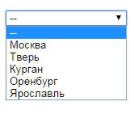
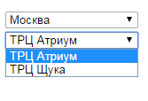

# Как реализовать простой ajax-запрос в приложении Catalyst

*Как добавить ajax-запрос при разработке Catalyst-приложения. Создание JSON-представления в Catalyst. Возврат данных в формате json. Изменение набора данных во втором элементе select, в засимости от того, какую строку пользователь выбрал в первом элементе select. Примеры perl-кода, html, js-скрипт. Установка jQuery.*

## AJAX - Asynchronous Javascript And Xml
Ajax-запросы хороши тем, что можно получать данные от сервера, не перезагружая страницу. Например, пользователь выбирает что-то в выпадающем списке, браузер отправляет запрос к серверу, получает массив данных в json-формате, парсит его и с помощью JS выводит на странице.

Технология ajax - асинхронна. Браузер, сделав запрос, может делать что угодно - прокручивать страницу, показывать сообщения об ожидании ответа и т.п. Пользователь, в ожидании результата, смотрит не на пустую белую страницу, а просто продолжает читать текст, рассматривать картинки.

Благодаря тому, что вместо всей страницы с картинками и html-разметкой, подгружается только небольшая часть данных - увеличивается скорость реакции страницы на действия пользователя, снижается объем передаваемых данных (что очень полезно для пользователей с медленным интернетом, например, на мобильных устройствах, особенно, вне крупных населенных пунктов).

Больше всего ajax полезен для простых элементов, связанных с простыми и понятными действиями: добавить товар в корзину, подписаться на рассылку, проголосовать в опросе, запросить список городов в анкете, и т.п.

Ниже приведен пример реализации простого ajax-запроса. Код строится на основе ранее созданного приложения:
<ul>
<li><a href="Catalyst_intro.md">Как создать catalyst-приложение с нуля</a></li>
<li><a href="Catalyst_chained.md">Catalyst и его chained</a></li>
<li><a href="Catalyst_Plugin_Static_Simple.md">Использование статики в catalyst-приложении</a></li>
</ul>

Пример сделан максимально простым, для того, чтобы передать идею и смысл, не зарываясь в детали обработки запроса. Зато - полностью работоспособный.

## Как добавить ajax-запросы в Catalyst-приложение. Примеры кода

**Описание задачи:**
На html-странице располагается форма с двумя элементами select. Первый select содержит список городов. В зависимости от того, какой город выберет клиент, мы выводим во втором select список магазинов. Список не является стабильным, достаточно часто меняется. Поэтому, данные во второй select подгружаются с помощью ajax-запроса, а не зашиты в страничку.

Что бы в нашем приложении появились ajaх-запросы, нам требуется:
<ol>
<li>Создать JSON-представление в Catalyst</li>
<li>Создать подпрограмму на сервере, которая будет принимать запрос, готовить данные и вернет результат</li>
<li>Скачать и установить jQuery</li>
<li>Создать шаблон html-страницы</li>
<li>Создать JS-скрипт, который инициирует ajax-запрос и обрабатывает результат</li>
</ol>

### Добавляем jQuery на наш сервер

jQuery можно добавить на сайт двумя способами: подгружать извне, ссылаясь на другой ресурс или скачать файл с официального сайта jQuery. Я выбираю второй способ.

<a href="http://jquery.com">Официальный сайт jQuery</a>

Скачанный файл <font color="#00aa00">jquery-2.1.1 .min.js</font> я сохранила в
директории <font color="#00aa00">/root/static/js</font> .

### JSON-представление

Создаем представление:
<pre>
root@localhost:~/www/app$ perl script/app_create.pl view JSON JSON
 exists "/home/www/app/script/../lib/app/View"
 exists "/home/www/app/script/../t"
created "/home/www/app/script/../lib/app/View/JSON.pm"
created "/home/www/app/script/../t/view_JSON.t"
</pre>
Иногда, если к работе JSON есть какие-то особые пожелания, требуется после создания нового представления добавить новые конфигурационные данные в файл <font color="#00aa00">/lib/app.pm</font> , но в данном случае это не обязательно.

Тем не менее, после того, как создано JSON-представление, в файле <font color="#00aa00">/lib/app.pm</font> надо указать - какое представление будет использоваться системой по-умолчанию. Иначе, может оказаться так, что все страницы вашего приложения вдруг стали отдаваться в JSON-формате:

<pre>
__PACKAGE__->config(
    ...
    default_view => 'TT',
);
</pre>

### Создание подпрограммы для обработки ajax-запроса

*/lib/app/Controller/Root.pm* :

```perl
use Variable::Eject;

sub index :Path :Args(0) {
    my ( $self, $c ) = @_;

    $c->stash->{template} = 'index.tt';
}

sub get_list :Path('/get_list') {
    my ( $self, $c ) = @_;

    eject ($c->req->params, $city_id);

    if ($city_id eq "1") {
        $c->stash->{'json'} = [ {name => 'ТРЦ Атриум', id=> 1}, 
        {id=>2, name=>'ТРЦ Щука'} ];
    } else {
        $c->stash->{'json'} = [ {name => 'Name11', id=> 11}, 
        {id=>22, name=>'Name22'}, {id=>33, name=>'Name33'} ];
    }

    $c->forward('View::JSON');
}
```

Уже на этом этапе можно проверить работоспособность JSON в нашем Catalyst-приложении. Запускаем сервер:
<pre>perl script/app_server.pl --port 3001</pre>

Вызываем метод get_list:
<pre>http://localhost:3001/get_list</pre>

Если все ОК, вы получите вот такой текст на странице:
<pre>{"json":[{"name":"Name11","id":11},{"name":"Name22","id":22},
{"name":"Name33","id":33}]}
</pre>

### Создаем шаблон страницы и JS-скрипт

```html
<title>Localhost:3001</title>
<script type="text/javascript" src="/static/js/jquery-2.1.1.min.js"></script>
<select name="city_id" id="city_id" style="width:150px;">
<option value="0" selected="">--</option>
<option value="1">Москва</option>
<option value="2">Тверь</option>
<option value="3">Курган</option>
<option value="4">Оренбург</option>
<option value="5">Ярославль</option>
</select>

<select name="shops" id="shops_id">
<option value=""></option>
</select>

<script>
$(document).ready(function() {
  $('select[name="city_id"]').change(function(){

    var sel = document.getElementById("city_id");
    var val = sel.options[sel.selectedIndex].value;
    $.ajax({
      url: '/get_list',
      data: {city_id: val},
      type: 'POST',
      dataType: 'json',

      success: function(data2){
        var objSel = document.getElementById("shops_id");
        objSel.options.length = 0;
        data = data2.json;
        for(var i = 0; i<data.length; i++) {
          objSel.options[i] = new Option(data[i]['name'], data[i]['id']);
        }
      }
    });
  });
});

</script>
```

Запускаем сервер и смотрим результат.





