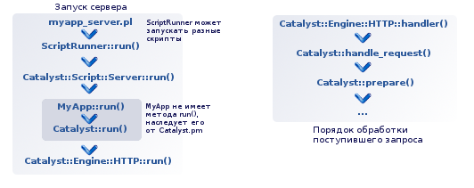
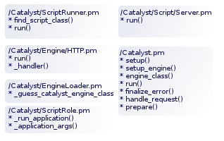

# Логика работы Catalyst. Часть 1

*Заметка по логике работы Catalyst. В данной заметке я не ставлю перед собой цели написать понятный текст :) , не знаю, возможно ли это вообще, когда речь идет о логике Catalyst. Только сохранить для себя важные моменты, куски кода. Но возможно, кому-то пригодится.*

Попытка разобраться в логике запуска стандартного сервера Catalyst-приложения.

Ниже приведено очень много кода из модулей Catalyst-фреймворка и простого Catalyst-приложения. Весь код приведен с большими сокращениями.

Запуск скрипта myapp_server.pl:
<pre>perl script/myapp_server.pl -p 3000 -r &amp;&gt; server_log</pre>

**/script/myapp_server.pl :**

```perl
#!/usr/local/bin/perl

BEGIN {
    $ENV{CATALYST_SCRIPT_GEN} = 40;
}

use Catalyst::ScriptRunner;
Catalyst::ScriptRunner->run('MyApp', 'Server');

1;
```

**/Catalyst/ScriptRunner.pm :**

```perl
package Catalyst::ScriptRunner;

sub find_script_class {
    my ($self, $app, $script) = @_;
    return load_first_existing_class("${app}::Script::${script}", "Catalyst::Script::$script");
}

sub run {
    my ($self, $appclass, $scriptclass) = @_;
    my $class = $self->find_script_class($appclass, $scriptclass);

    $class->new_with_options( application_name => $appclass )->run;
}
```

В обычном случае, метод find_script_class() вернет класс "Catalyst::Script::Server", потом будет вызван метод run() для указанного класса.

**/Catalyst/Script/Server.pm :**

```perl
package Catalyst::Script::Server;
with 'Catalyst::ScriptRole';

sub run {
    my $self = shift;

    if ( $self->restart ) {
        # do_something
    }
    else {
       $self->_run_application;
    }
}
```

Внутри метода run() производится вызов метода _run_application(), который находится в Catalyst::ScriptRole.

**/Catalyst/ScriptRole.pm :**

```perl
package Catalyst::ScriptRole;

sub _run_application {
    my $self = shift;
    my $app = $self->application_name;
    load_class($app);
    my $server;
    if (my $e = $self->_plack_engine_name ) {
        $server = $self->load_engine($e, $self->_plack_loader_args);
    }
    else {
        $server = $self->autoload_engine($self->_plack_loader_args);
    }
    $app->run($self->_application_args, $server);
}

sub _application_args {
    my $self = shift;
    return {
        argv => $self->ARGV,
        extra_argv => $self->extra_argv,
    }
}
```

Внутри метода _run_application() производится вызов $app-&gt;run(). Ожидается, что метод run() реализован в модуле MyApp.pm, однако MyApp сам метода run() не содержит, он наследует его от Catalyst.pm .

**/lib/MyApp.pm :**

```perl
package MyApp;
use Moose;
use namespace::autoclean;

use Catalyst::Runtime 5.80;
extends 'Catalyst';

__PACKAGE__->config(
    name => 'MyApp',
);

__PACKAGE__->setup();

1;
```

Метод run() модуля Catalyst.pm выбирает движок для работы и выполняет метод run(), который расположен в выбранном движке.

**/Catalyst.pm :**

```perl
package Catalyst;

use Catalyst::EngineLoader;

__PACKAGE__->mk_classdata($_)
  for qw/dispatcher engine log engine_loader /;

sub setup {
    my ( $class, @arguments ) = @_;

    $class->setup_engine();
}

sub setup_engine {
    my ($class, $requested_engine) = @_;
    my $engine = do {
        my $loader = $class->engine_loader;

        if (!$loader || $requested_engine) {
            $loader = Catalyst::EngineLoader->new({
                application_name => $class,
                (defined $requested_engine ? (requested_engine => $requested_engine) : ()),
            }),

            $class->engine_loader($loader);
        }

        $loader->catalyst_engine_class;        
    }
    $class->engine( $engine->new );

    return;
}

sub engine_class {
    my ($class, $requested_engine) = @_;

    if (!$class->engine_loader || $requested_engine) {
        $class->engine_loader(
            Catalyst::EngineLoader->new({
                application_name => $class,
                (defined $requested_engine
                     ? (catalyst_engine_class => $requested_engine) : ()),
            }),
        );
    }

    $class->engine_loader->catalyst_engine_class;
}

sub run {
  my $app = shift;
  $app->_make_immutable_if_needed;
  $app->engine_loader->needs_psgi_engine_compat_hack ?
    $app->engine->run($app, @_) :
      $app->engine->run( $app, $app->_finalized_psgi_app, @_ );
}

sub finalize {
    my $c = shift;

    my $engine = $c->engine;
    if ( my $code = $engine->can('finalize') ) {
        $engine->$code($c);
    }
}

sub finalize_error {
    my $c = shift;
    if($#{$c->error} > 0) {
        $c->engine->finalize_error( $c, @_ );
    }
}

sub handle_request {
    my ( $class, @arguments ) = @_;

    my $status = -1;
    try {
        my $c = $class->prepare(@arguments);
        $c->dispatch;
        $status = $c->finalize;
    }
    return $status;
}

sub prepare {
    my ( $class, @arguments ) = @_;

    my $c = $class->context_class->new({ $uploadtmp ? (_uploadtmp => $uploadtmp) : ()});

    $c->response->_context($c);
    $c->stats($class->stats_class->new)->enable($c->use_stats);

    try {
        if ( my $prepare = $c->engine->can('prepare') ) {
            $c->engine->$prepare( $c, @arguments );
        }
        else {
            $c->prepare_request(@arguments);
            $c->prepare_connection;
            $c->prepare_query_parameters;
            $c->prepare_headers; # Just hooks, no longer needed - they just
            $c->prepare_cookies; # cause the lazy attribute on req to build
            $c->prepare_path;

            $c->prepare_read;

            unless ( ref($c)->config->{parse_on_demand} ) {
                $c->prepare_body;
            }
        }
        $c->prepare_action;
    }
    catch {
        $c->response->status(400);
        $c->response->content_type('text/plain');
        $c->response->body('Bad Request');
        $c->finalize;

        die $_;
    };

    $c->log_request;

    return $c;

}
```

**/Catalyst/EngineLoader.pm :**

```perl
package Catalyst::EngineLoader;

has catalyst_engine_class => (
    isa => 'Str',
    is => 'rw',
    lazy => 1,
    builder => '_guess_catalyst_engine_class',
);

sub _guess_catalyst_engine_class {
    my $self = shift;
    my $old_engine = $self->has_requested_engine
        ? $self->requested_engine
        : Catalyst::Utils::env_value($self->application_name, 'ENGINE');
    if (!defined $old_engine) {
        return 'Catalyst::Engine';
    }
    elsif ($old_engine eq 'PSGI') {
        return 'Catalyst::Engine::' . $old_engine;
    }
    elsif ($old_engine =~ /^(CGI|FastCGI|HTTP|Apache.*)$/) {
        return 'Catalyst::Engine';
    }
    else {
        return 'Catalyst::Engine::' . $old_engine;
    }
}

around guess => sub {
    my ($orig, $self) = (shift, shift);
    my $engine = $self->$orig(@_);

    my $old_engine = Catalyst::Utils::env_value($self->application_name, 'ENGINE');
    if (!defined $old_engine) { # Not overridden
    }
    elsif ($old_engine =~ /^(PSGI|CGI|Apache.*)$/) {
        # Trust autodetect
    }
    elsif ($old_engine eq 'HTTP') {
        $engine = 'Standalone';
    }
    elsif ($old_engine eq 'FastCGI') {
        $engine = 'FCGI';
    }
    elsif ($old_engine eq "HTTP::Prefork") { 
        $engine = "Starman";
    }
    elsif ($old_engine eq "HTTP::POE") {
        Catalyst::Exception->throw("HTTP::POE engine no longer works, 
        recommend you use Twiggy instead");
    }
    elsif ($old_engine eq "Zeus") {
        Catalyst::Exception->throw("Zeus engine no longer works");
    }
    else {
        warn("You asked for an unrecognised engine '$old_engine' which is no
        longer supported, this has been ignored.\n");
    }

    return $engine;
};
```

Метод run() выбранного движка создает сокеты для работы, начинает прослушивать выбранный порт на предмет поступления запросов. Если пришел запрос, то движок может создать дочерний процесс и вызвать обработчик, например _handler . Этот обработчик получит данные из сокета и вызовет другой обработчик, в обычном случае - handle_request() модуля Catalyst.pm .

**/Catalyst/Engine/HTTP.pm :**

```perl
package Catalyst::Engine::HTTP;

sub run {
    my ( $self, $class, $port, $host, $options ) = @_;

    # Setup socket
    my $daemon = IO::Socket::INET->new(
        Listen    => SOMAXCONN,
        LocalAddr => inet_ntoa($addr),
        LocalPort => $port,
        Proto     => 'tcp',
        ReuseAddr => 1,
        Type      => SOCK_STREAM,
      )
      or die "Couldn't create daemon: $@";

    LISTEN:
    while ( !$restart ) {
        while ( accept( Remote, $daemon ) ) {
            DEBUG &amp;&amp; warn "New connection\n";

            select Remote;
            unless ( uc($method) eq 'RESTART' ) {

                # Fork
                if ( $options->{fork} ) {
                    if ( $pid = fork ) {
                        DEBUG &amp;&amp; warn "Forked child $pid\n";
                        next;
                    }
                }

                $self->_handler( $class, $port, $method, $uri, $protocol );
              }
            }
        }
        continue {
            close Remote;
        }
    }

    $daemon->close;
    exit;
}
sub _handler {
    my ( $self, $class, $port, $method, $uri, $protocol ) = @_;

    local *STDIN  = \*Remote;
    local *STDOUT = \*Remote;

    my %copy_of_env = %ENV;

    my $sel = IO::Select->new;
    $sel->add( \*STDIN );

    REQUEST:
    while (1) {
        $class->handle_request( env => \%ENV );
    }

    close Remote;
}
```

Если у нас нет никаких особых реализаций движка (методы могут быть переопределены),
то метод handle_request() вызовет в этом же модуле метод prepare(), а дальше начнется целый цикл поочередного вызова методов:

```perl
$c->prepare_request(@arguments);
$c->prepare_connection;
$c->prepare_query_parameters;
$c->prepare_headers; 
$c->prepare_cookies; 
$c->prepare_path;

$c->prepare_read;

$c->prepare_body;
$c->prepare_action;
```

Если попытка выполнения всех этих обработчиков в какой-то момент окончится неудачей, будет запущена другая последовательность обработчиков:

```perl
$c->response->status(400);
$c->response->content_type('text/plain');
$c->response->body('Bad Request');
$c->finalize;
die $_;
```

главной целью которых будет вывод клиенту сообщения об ошибке и грамотное завершение обработки запроса.

Если выполнение первой цепочки методов прошло успешно, будут вызваны еще несколько обработчиков:

```perl
$c->dispatch;
$c->finalize;
$c->log_request;
```

Естественно, закончится все это отправкой ответа пользователю на обработанный запрос.
Примерная логика запуска сервера для Catalyst-приложения:




**Резюме:** скрипт myapp_server.pl вызывает Catalyst::ScriptRunner-&gt;run(),
Catalyst::ScriptRunner-&gt;run() вызывает Catalyst::Script::Server-&gt;run(),
Catalyst::Script::Server-&gt;run() вызывает метод _run_application() (который "наследуется" от Catalyst::ScriptRole).
Внутри метода _run_application() производится вызов $app-&gt;run(). Вызывается метод run() модуля Catalyst.

Далее выбирается движок для сервера и выполняется метод run(), который расположен в модуле выбранного движка.
Движок создает сокеты, процессы и т.п., и после этого приложение готово принимать запросы, обрабатывать их.
Модули и их функции, которые имеют решающее значение при запуске сервера:




## Краткие характеристики некоторых используемых выше методов

**$c-&gt;prepare_request(@arguments);**

Вызывает метод prepare_request() в выбранном движке (например, в Catalyst::Engine::HTTP), кроме этого ничего дополнительного не делает.

```perl
sub prepare_request {
    my $c = shift;
    $c->engine->prepare_request( $c, @_ );
}
```

Если в движке метод prepare_request() не реализован, будет выполняться поиск в базовых классах Engine. Обработка строки запроса (QUERY_STRING) и извлечение параметров запроса.

**$c-&gt;prepare_connection;**

Выполняет вызов метода prepare_connection() из модуля Catalyst::Request . Метод prepare_connection() задает параметры запроса (address, hostname, protocol, remote_user, method, secure), получая их из переменных окружения.

Пример:

```perl
$self->address( $env->{REMOTE_ADDR} );
```

**$c-&gt;prepare_query_parameters;**

**$c-&gt;prepare_headers;**

Вызывает метод headers() модуля Catalyst::Request, в конечном счете идет обращение к HTTP::Headers, метод header().

**$c-&gt;prepare_cookies;**

Идет вызов $c-&gt;request-&gt;cookies.

**$c-&gt;prepare_path;**

Выполняет вызов $c-&gt;engine-&gt;prepare_path( $c, @_ ) . Метод prepare_path, реализованный в модуле движка, в свою очередь обрабатывает путь (URI), который будет передан $c-&gt;request-&gt;base() .

**$c-&gt;prepare_read;**

Вызывает $c-&gt;engine-&gt;prepare_read( $c, @_ ) . Получает информацию о "Content-Length" запроса.

**$c-&gt;prepare_body;**

Данный метод инициирует вызов еще несколько методов:

```perl
    $c->engine->prepare_body( $c, @_ );
    $c->prepare_parameters;
    $c->prepare_uploads;
```

**$c-&gt;prepare_action;**

Подготовка экшена. Для этого вызывается $c-&gt;dispatcher-&gt;prepare_action( $c, @_) . Возвращает ссылку на объект. Подбирает подходящий dispatch type, который подбирается по $c-&gt;req-&gt;path:

```perl
    foreach my $type ( @{ $self->dispatch_types } ) {
        last DESCEND if $type->match( $c, $path );
    }
```

**$c-&gt;dispatch;**

Вызывает $c-&gt;dispatcher-&gt;dispatch( $c, @_ ) .

```perl
package Catalyst::Dispatcher;

sub dispatch {
    my ( $self, $c ) = @_;
    if ( my $action = $c->action ) {
        $c->forward( join( '/', '', $action->namespace, '_DISPATCH' ) );
    }
    ...
}
```

**$c-&gt;finalize;**

Завершение обработки запроса, в том числе запись в логи.
