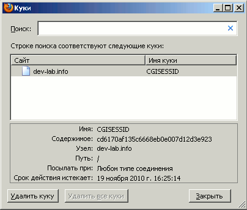

# Пример использования CGI::Application::Plugin::Session. Хранение сессии в файлах

*<font color="#00aa00">CGI::Application</font> поразил меня в очередной раз. Реализация работы с сессиями через <font color="#00aa00">CGI::Application::Plugin::Session</font> потрясающе удобна и порождает элегантный код.*

## Описание задачи

Была поставлена задача создать пример использования <font color="#00aa00">CGI::Application::Plugin::Session</font>. Пример "чистой" сессии, без авторизаций, аутентификаций и пр.

## Примеры кода

### Скрипт cgi

```perl
#!/usr/bin/perl
 
use strict;
use warnings;
 
use App3;

# для тестирования работы с сессиями 
App3->new->run;
```

### Модуль pm

```perl
package App3;
use strict;
use warnings;
 
use base 'CGI::Application';
use CGI::Application::Plugin::TT;

use CGI::Session::Driver::file;
use CGI::Application::Plugin::Session;
 
sub setup {
  my $self = shift;

  $self->mode_param('step');
  $self->start_mode('on_start');	

  $self->run_modes(
    on_start => \&on_start,
    on_save_addr => \&on_save_addr,
    on_close_session => \&on_close_session,
    AUTOLOAD => sub { return 'Запрошенной страницы не существует' }
  );
}

sub cgiapp_init {
  my $self = shift;
 
  # Configure the session
  $self->session_config(
    CGI_SESSION_OPTIONS => [ "driver:File", $self->query, {Directory=>'/dev-lab/tmp'} ],
    DEFAULT_EXPIRY      => '+1w',
    COOKIE_PARAMS       => {
      -expires => '+24h',
      -path    => '/',
    },
    SEND_COOKIE         => 1,
  );
}

sub on_start {
  my $self = shift;
  my $q = $self->query();
  my $tt_params = {};
	
  $tt_params->{addr} = $self->session->param('addr');
  $tt_params->{block} = 'show_index_page';

  return $self->tt_process('template3.tt', $tt_params);
}

sub on_save_addr {
  my $self = shift;
  my $tt_params = {};
  my $q = $self->query();

  $self->session->param('addr', $q->param('addr'));
  return $self->on_start;
}

sub on_close_session {
  my $self = shift;
  my $tt_params = {};

  $self->session_delete;

  $tt_params->{block} = 'show_close_session_page';
  return $self->tt_process('template3.tt', $tt_params);
}
```

### Шаблон tt

```perl
<meta http-equiv="Content-Type" content="text/html; charset=windows-1251">
<title>session</title>

<h1>Session</h1>

[%- TRY -%]
  [%-INCLUDE $block-%]
[%- CATCH -%]
  Ошибочка вышла
[%- END -%]

[%-#-----------------------------------------%]
[%-BLOCK show_index_page-%]
[%-#-----------------------------------------%]

[%-IF addr-%]
  
[%-addr-%]
  <form action="app3.cgi" method="POST">
  <input type="hidden" name="step" value="on_close_session">
  <input value="Завершить сессию" type="submit">
  </form>

[%-ELSE-%]
  
Укажите почтовый адрес:
  <form action="app3.cgi" method="POST">
  <input type="hidden" name="step" value="on_save_addr">
	
  <textarea name="addr" cols="40" rows="3"></textarea>
  <input value="Сохранить адрес" type="submit">
  </form>
[%-END-%]


[%-#-----------------------------------------%]
[%-END-%]


[%-#-----------------------------------------%]
[%-BLOCK show_close_session_page-%]
[%-#-----------------------------------------%]

Ваша сессия завершена. До свидания!

[%-#-----------------------------------------%]
[%-END-%]
```

## Результаты работы

После обращения клиента создается простая сессия. Клиент может указать какие-то данные (в данном случае, это его адрес, а могли бы быть персональные данные, или содержимое корзины товаров), которые будут привязаны к сессии и сохраняться до ее окончания.

Если клиент указал свои данные, они будут отображаться ему при каждом посещении страницы, пока он
<ul>
<li>не завершит сессию принудительно,</li>
<li>срок действия сессии не иссякнет автоматически.</li>
</ul>
Данные сессии хранятся в текстовом файле.

### Файл сессии

По адресу /dev-lab/tmp автоматически создается файл сессии.

Например, cgisess_cd6170af135c6668eb0e007d12d3e923:
<pre>$D = {
  '_SESSION_ETIME' =&gt; 604800,
  '_SESSION_ID' =&gt; 'cd6170af135c6668eb0e007d12d3e923',
  '_SESSION_ATIME' =&gt; 1290085972,
  'addr' =&gt; 'Moscow, Krasnopresnenskaya nabereznaya, 8 korp.10',
  '_SESSION_REMOTE_ADDR' =&gt; '127.0.0.1',
  '_SESSION_EXPIRE_LIST' =&gt; {},
  '_SESSION_CTIME' =&gt; 1290001182
};;$D
</pre>
Каждой сессии соответствует свой собственный файл.

### Cookies

Браузер сохраняет для себя cookies, с номером сессии, датой ее окончания и т.п.




