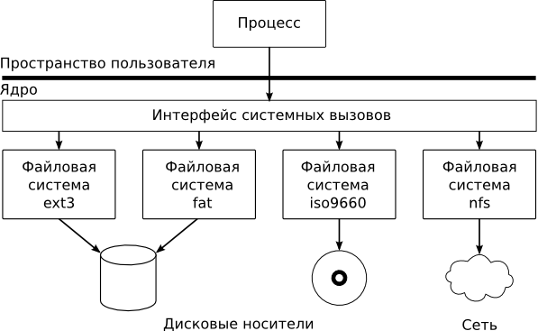

# Что такое файловый дескриптор

*Где хранится файловый дескриптор и что из себя представляет? Как просмотреть список файловых дескрипторов для процесса? Что такое таблица файловых дескрипторов? Типы файлов в Unix. Утилиты и команды: lsof, fuser, ulimit, strace, pstree, top, pidof, pgrep.*

*В этот раз я решила разобраться, что из себя представляет файловый дескриптор. Ниже - небольшой конспект рассмотренной информации. К сожалению, так и не удалось запустить утилиту Crash(M1), для анализа дампов ядра. Оказалось, что утилита существует только на Solaris, а в наличии только Debian. Поэтому, рассмотреть систему файловых дескрипторов изнутри не получилось.*

## Типы файлов в Unix

Помимо каталогов и обычных файлов для хранения информации, файловая система может содержать следующие виды файлов:

<ul>
<li>Специальный файл устройства</li>
<li>Именованный канал</li>
<li>Символьная ссылка</li>
<li>Сокет</li>
</ul>

Пример:
<pre>
$ ls /dev/ -la
drwxr-xr-x  6 root root     1380 Сен 25 09:36 .
drwxr-xr-x 23 root root     4096 Ноя 13 18:58 ..
drwxr-xr-x  2 root root      500 Мар 22  2014 char
crw-------  1 root root   5,   1 Сен  2 01:31 console
lrwxrwxrwx  1 root root       13 Мар 22  2014 fd -&gt; /proc/self/fd
drwxr-xr-x  2 root root        0 Ноя 13 18:58 pts
crw-r--r--  1 root root   2,   0 Мар 22  2014 ptyp0
crw-r--r--  1 root root   2,   1 Мар 22  2014 ptyp1
crw-rw-rw-  1 root root   1,   8 Мар 22  2014 random
lrwxrwxrwx  1 root root        8 Мар 22  2014 shm -&gt; /run/shm
b-----x---  1 root root 145,  14 Сен 25 09:36 simfs
lrwxrwxrwx  1 root root       15 Мар 22  2014 stderr -&gt; /proc/self/fd/2
lrwxrwxrwx  1 root root       15 Мар 22  2014 stdin -&gt; /proc/self/fd/0
lrwxrwxrwx  1 root root       15 Мар 22  2014 stdout -&gt; /proc/self/fd/1
crw-rw-rwT  1 root root   5,   0 Ноя 20 11:03 tty
crw-------  1 root root   4,   0 Мар 22  2014 tty0
crw-r--r--  1 root root   3,   0 Мар 22  2014 ttyp0
crw-r--r--  1 root root   3,   1 Мар 22  2014 ttyp1
prw-r-----  1 root adm         0 Сен  1 06:51 xconsole
</pre>

Директория dev (от devices) содержит файлы почти всех возможных в unix типов, поэтому она идеальна для примера. Первый символ в строке "crw-rw-rw-" - обозначает тип файла. Типы файлов могут принимать следующие значения:

<ul>
<li>- для обычного файла,</li>
<li>d для каталога,</li>
<li>b для блочного устройства,</li>
<li>c для символьного устройства,</li>
<li>l для символической ссылки,</li>
<li>p для FIFO,</li>
<li>s для гнезда (socket).</li>
</ul>

Пользователь, программирующий в unix среде, к каждому из этих типов файлов обращается с помощью стандартных системных вызовов. После вызова, операционная система анализирует, к какому типу файла идет обращение, и в зависимости от этого, либо, делает обращение к файловой системе, либо к драйверу устройства.
Файловая подсистема операционной системы UNIX имеет специальный уровень абстракции для обработки запросов к файлам — переключатель файловых систем или виртуальная файловая система (VFS). VFS предоставляет пользователю стандартный набор функций (интерфейс) для работы с файлами, вне зависимости от места их расположения и принадлежности к разным файловым системам.



Задача VFS — по полному имени файла найти его местоположение в дереве файловой системы,
определить её тип в этом месте дерева и «переключить», т. е. передать файл на дальнейшую обработку драйверу конкретной файловой системы. Такой подход позволяет использовать практически неограниченное количество различных файловых систем на одном компьютере под управлением одной операционной системы, а пользователь даже не будет знать, что файлы физически находятся на разных носителях информации.

## Системные вызовы для взаимодействия с файлами

Некоторые системные вызовы для работы с файлами:

<table>
<tbody>
<tr>
<td>fd=open(name,how,j)</td>
<td>Открыть файл для чтения, записи, или для чтения и записи</td>
</tr>
<tr>
<td>fd=creat(name,mode)</td>
<td>Создать новый файл</td>
</tr>
<tr>
<td>s=close(fd)</td>
<td>Закрыть открытый файл</td>
</tr>
<tr>
<td>n=read(fd,buffer,nbytes)</td>
<td>Прочитать данные из файла в буфер</td>
</tr>
<tr>
<td>n=write(fd,buffer,nbytes)</td>
<td>Записать данные из буфера в файл</td>
</tr>
<tr>
<td>position=lseek(fd,offset,whence)</td>
<td>Переместить указатель в файле</td>
</tr>
<tr>
<td>s=stat(name,&amp;buf)</td>
<td>Получить информацию о состоянии файла</td>
</tr>
<tr>
<td>s=fstat(fd,&amp;buf)</td>
<td>Получить информацию о состоянии файла</td>
</tr>
<tr>
<td>s=pipe(&amp;fd[0])</td>
<td>Создать канал</td>
</tr>
<tr>
<td>s=fcntl(fd,cmd,...)</td>
<td>Блокировка файла</td>
</tr>
</tbody>
</table>

## Что такое файловый дескриптор

Успешный вызов <font color="#00aa00">creat()</font>, <font color="#00aa00">open()</font> или <font color="#00aa00">pipe()</font> - возвращают небольшое неотрицательное целое число, которое называют <b>дескриптором файла</b>. Если произошла ошибка, то системный вызов вернет -1. Системные вызовы <font color="#00aa00">creat()</font> и <font color="#00aa00">open()</font> возвращают наименьший неиспользуемый в данный момент дескриптор файла.

Информация об открытых файлах хранится в ядре системы UNIX. Значение, возвращаемое <font color="#00aa00">open()</font>, является индексом в таблице файловых дескрипторов.

Таблица файловых дескрипторов, размещенная в пользовательской области процесса, содержит указатели на системные структуры файлов.

При запуске shell, например при логине или при запуске командой sh, открывается новая shell-сессия, внутри которой создаются псевдофайлы символьных ссылок на устройства
ввода-вывода <font color="#00aa00">/dev/stdin</font>, <font color="#00aa00">/dev/stdout</font> и <font color="#00aa00">/dev/stderr</font>, в которые потоки ввода-вывода можно перенаправлять так же, как в обычные текстовые файлы. Когда под оболочкой запускается программа, в системе создается новый процесс, который является для этой оболочки дочерним процессом, следовательно, получает копию таблицы дескрипторов своего родителя (то есть все открытые файлы родительского процесса).

Таким образом, когда программа начинает свое выполнение, файлы с дескрипторами 0, 1 и 2 уже открыты для стандартного ввода, вывода и потока сообщений об ошибках. При этом, программа даже не знает, что открытые ею файлы, строго говоря, файлами не являются.

Таблица дескрипторов, помимо всего прочего, содержит информацию о текущей позиции чтения-записи для каждого дескриптора. При открытии файла, позиция чтения-записи устанавливается в ноль. Каждый прочитанный или записанный байт увеличивает на единицу указатель текущей позиции.

Системный вызов <font color="#00aa00">close()</font> закрывает файл. При завершении процесса все открытые файлы (кроме файлов с дескрипторами 0, 1 и 2) автоматически закрываются. Однако, если файлы не закрывать самостоятельно, то соответствующие дескрипторы могут не освобождаться, что приводит к превышению лимита открытых файлов.

**Файловая система Linux поддерживает механизм буферизации**. Это означает, что данные, которые якобы записываются, реально записываются на носитель (синхронизируются) только через какое-то время, когда система сочтет это правильным и оптимальным. Это повышает производительность системы и даже продлевает ресурс жестких дисков. Системный вызов <font color="#00aa00">close()</font> не форсирует запись данных на диск, однако дает больше гарантий того, что данные будут сохранены. Возвращаемое значение - ноль в случае успеха, и -1 - в случае ошибки.

Системный вызов <font color="#00aa00">read()</font>, позволяет читать данные из файла. Системный вызов <font color="#00aa00">read()</font> читает данные в "сыром" виде, то есть как последовательность байт, без какой-либо интерпретации.

Для записи данных в файл используется системный вызов <font color="#00aa00">write()</font>. В принципе <font color="#00aa00">write()</font> выполняет процедуру, обратную
<font color="#00aa00">read()</font>: записывает count байтов из буфера <font color="#00aa00">buffer</font> в файл с дескриптором <font color="#00aa00">fd</font>, возвращая количество записанных байтов или -1 в случае ошибки.

Для изменения текущей позиции чтения-записи используется системный вызов <font color="#00aa00">lseek()</font>. В случае удачного завершения, <font color="#00aa00">lseek()</font> возвращает значение установленной "новой" позиции относительно начала файла. В случае ошибки возвращается -1.

```perl
use strict;
     
my $filename = $0;
open(my $fh, '<:encoding(UTF-8)', $filename)
  or die "Could not open file '$filename' $!";
     
while (my $row = <$fh>) {
  chomp $row;
  print "$row\n";
}
    
close($fh);
exit;
```

### Таблица файловых дескрипторов

Ядро обеспечивает работу процесса с файлами, используя различные структуры данных, часть из которых расположена в u-area процесса.

Поля структуры user, связанные с файловым дескриптором:
<ul>
<li>u_ofile - Указатель на системную файловую таблицу</li>
<li>u_pofile - Флаги файлового дескриптора</li>
</ul>

Содержимое таблицы дескрипторов процесса можно посмотреть с помощью утилиты crash(1M).
Команда user покажет содержимое u-area процесса. Например, для текущего командного интерпретатора мы получим следующую информацию:
<pre>$ crash
&gt; proc #8591
PROC TABLE SIZE = 1498
SLOT ST  PID PPID PGID  SID UID PRI NAME FLAGS
 121  s 8591 8589 8591 8591 286  48 bash load jctl
&gt; user 121
PER PROCESS USER AREA FOR PROCESS 121
PROCESS MISC:
 command: bash, psargs: -bash
 start: PO Mon 24 18:11:31 1997
 mem: 1ebc, type: exec
 vnode of current directory: f5b95e40
OPEN FILES, POFILE FLAGS, AND THREAD REFCNT:
  [0] : F 0xf62b6030, 0, 0 [1] : F 0xf62b6030, 0, 0
  [2] : F 0xf62b6030, 0, 0
 cmask: 0022
RESOURCE LIMITS:
 cpu time: unlimited/unlimited
...
</pre>

## Утилиты и команды, для получения информации о файловых дескрипторах

### pfiles и lsof

<font color="#00aa00">pfiles</font> (Solaris) - выводит список открытых файлов, дескрипторов, сокетов указанным процессом.

<font color="#00aa00">lsof</font> (от англ. LiSt of Open Files) — утилита, служащая для вывода информации о том, какие файлы используются теми или иными процессами.

<pre>
$ ps -u root -f
root     31696 31666  0 11:42 pts/2    00:00:00 perl file.pl

$ lsof -a -p 31696
COMMAND   PID USER   FD   TYPE  DEVICE SIZE/OFF       NODE NAME
perl    31696 root  cwd    DIR 144,147     4096    2564131 /home/aninatalie/diff
perl    31696 root  rtd    DIR 144,147     4096    2528296 /
perl    31696 root  txt    REG 144,147  1487332    4489619 /usr/bin/perl
perl    31696 root  mem    REG     8,3             4489619 /usr/bin/perl (path dev=144,147)
perl    31696 root  mem    REG     8,3             6441610 /usr/local/lib/perl/5.14.2/auto/Encode/Encode.so (path dev=144,147)
perl    31696 root  mem    REG     8,3             3415828 /usr/lib/perl/5.14.2/auto/PerlIO/encoding/encoding.so (path dev=144,147)
perl    31696 root  mem    REG     8,3             4457085 /usr/lib/locale/locale-archive (path dev=144,147)
perl    31696 root  mem    REG     8,3             6565272 /lib/i386-linux-gnu/libcrypt-2.13.so (path dev=144,147)
perl    31696 root  mem    REG     8,3             6565131 /lib/i386-linux-gnu/libc-2.13.so (path dev=144,147)
perl    31696 root  mem    REG     8,3             6565158 /lib/i386-linux-gnu/libpthread-2.13.so (path dev=144,147)
perl    31696 root  mem    REG     8,3             6565127 /lib/i386-linux-gnu/libm-2.13.so (path dev=144,147)
perl    31696 root  mem    REG     8,3             6565134 /lib/i386-linux-gnu/libdl-2.13.so (path dev=144,147)
perl    31696 root  mem    REG     8,3             6565284 /lib/i386-linux-gnu/ld-2.13.so (path dev=144,147)
perl    31696 root    0u   CHR   136,2      0t0          5 /dev/pts/2
perl    31696 root    1u   CHR   136,2      0t0          5 /dev/pts/2
perl    31696 root    2u   CHR   136,2      0t0          5 /dev/pts/2
perl    31696 root    3r   REG 144,147       39    2524004 /home/aninatalie/diff/file.txt
perl    31696 root    7w  FIFO     0,8      0t0 1693538472 pipe
</pre>

Небольшой отрывок из документации на <font color="#00aa00">lsof</font>:

<pre>
man lsof

FD   is the File Descriptor number of the file or:

     cwd  current working directory;
     err  FD information error (see NAME column);
     ltx  shared library text (code and data);
     Mxx  hex memory-mapped type number xx.
     mem  memory-mapped file;
     mmap memory-mapped device;
     pd   parent directory;
     rtd  root directory;
     tr   kernel trace file (OpenBSD);
     txt  program text (code and data);

  FD is followed by one of these characters, describing the mode 
  under which the file is open:

     r for read access;
     w for write access;
     u for read and write access;
     space if mode unknown and no lock character follows;
     `-' if mode unknown and lock character follows.


TYPE is the type of the node associated with the file - e.g., GDIR, 
GREG, VDIR, VREG, etc.

     or ``IPv4'' for an IPv4 socket;
     or ``IPv6'' for an open IPv6 network file - even if its address 
        is IPv4, mapped in an IPv6 address;
     or ``inet'' for an Internet domain socket;
     or ``BLK'' for a block special file;
     or ``CHR'' for a character special file;
     or ``DEL'' for a Linux map file that has been deleted;
     or ``DIR'' for a directory;
     or ``DOOR'' for a VDOOR file;
     or ``FIFO'' for a FIFO special file;
     or ``KQUEUE'' for a BSD style kernel event queue file;
     or ``LINK'' for a symbolic link file;
     or ``PIPE'' for pipes;
     or ``REG'' for a regular file;
</pre>

### fuser

<font color="#00aa00">fuser</font> — утилита, идентифицирующая процессы, которые используют указанные файлы или сокеты.
<pre>$ fuser -v /home/aninatalie/diff/file.txt
                     ПОЛЬЗ-ЛЬ    PID ДОСТУП КОМАНДА
/home/aninatalie/diff/file.txt:
                     root      31713 f.... perl
</pre>

### ulimit

Утилита <font color="#00aa00">ulimit</font> устанавливает ограничения на общесистемные ресурсы. Позволяет обеспечивать контроль над ресурсами для оболочки и процессов, запущенных под ее управлением, если это возможно. Данная утилита в строена в интерпретатор bash.
<pre>$ ulimit -n
1024
</pre>

<table>
<tbody>
<tr>
<td>-S</td>
<td>Установить мягкие ограничения для указанных ресурсов (Change and report the soft limit associated with a resource).</td>
</tr>
<tr>
<td>-H</td>
<td>Установить жесткие ограничения для указанных ресурсов (Change and report the hard limit associated with a resource).</td>
</tr>
<tr>
<td>-a</td>
<td>Сообщить о текущих ограничениях по всем ресурсам (All current limits are reported).</td>
</tr>
<tr>
<td>-c</td>
<td>Максимальный размер создаваемых файлов (The maximum size of core files created).</td>
</tr>
<tr>
<td>-d</td>
<td>Максимальный размер сегмента данных процесса (The maximum size of a process's data segment).</td>
</tr>
<tr>
<td>-e</td>
<td>Максимальный планируемый приоритет ("nice").</td>
</tr>
<tr>
<td>-f</td>
<td>Максимальный размер файла, записываемого с помощью оболочки и ее потомками (The maximum size of files created by the shell, default option).</td>
</tr>
<tr>
<td>-i</td>
<td>Максимальное количество ожидающих сигналов.</td>
</tr>
<tr>
<td>-l</td>
<td>Максимальный размер памяти, который может быть зарезервирован (The maximum size that may be locked into memory).</td>
</tr>
<tr>
<td>-m</td>
<td>Максимальный размер в памяти (The maximum resident set size).</td>
</tr>
<tr>
<td>-n</td>
<td>Максимальное количество открытых файловых дескрипторов (The maximum number of open file descriptors). Многие unix системы не позволяют изменять значения данного ресурса.</td>
</tr>
<tr>
<td>-p</td>
<td>Размер канала (pipe size) в 512-байтных блоках (нельзя изменять во многих операционных системах).</td>
</tr>
<tr>
<td>-q</td>
<td>Максимальное количество байт в очереди сообщений POSIX.</td>
</tr>
<tr>
<td>-r</td>
<td>Максимальный планируемый приоритет в реальном времени.</td>
</tr>
<tr>
<td>-s</td>
<td>Максимальный размер стека (The maximum stack size).</td>
</tr>
<tr>
<td>-t</td>
<td>Максимальная загрузка процессора в секундах (The maximum amount of cpu time in seconds).</td>
</tr>
<tr>
<td>-u</td>
<td>Максимальное количество процессов доступных одновременно одному пользователю (The maximum number of processes available to a single user).</td>
</tr>
<tr>
<td>-v</td>
<td>Максимальный размер виртуальной памяти доступный оболочке (The maximum amount of virtual memory available to the process).</td>
</tr>
<tr>
<td>-x</td>
<td>Максимальное количество файловых блоков.</td>
</tr>
</tbody>
</table>

### truss и strace

<font color="#00aa00">truss</font> (Solaris) - аналог <font color="#00aa00">strace</font>.

<pre>$ apt-get install strace</pre>

<font color="#00aa00">Strace</font> - это утилита, которая отслеживает системные вызовы, которые представляют собой механизм трансляции, обеспечивающий интерфейс между процессом и операционной системой (ядром).

<pre>$ strace perl file.pl
...
read(3, "package Encode::Encoding;\n\n# Bas"..., 8192) = 8192
_llseek(3, 1496, [1496], SEEK_SET)      = 0
_llseek(3, 0, [1496], SEEK_CUR)         = 0
close(3)                                = 0
open("file.txt", O_RDONLY|O_LARGEFILE)  = 3
ioctl(3, SNDCTL_TMR_TIMEBASE or TCGETS, 0xbff79338) = -1 ENOTTY 
(Inappropriate ioctl for device)
_llseek(3, 0, [0], SEEK_CUR)            = 0
ioctl(3, SNDCTL_TMR_TIMEBASE or TCGETS, 0xbff79348) = -1 ENOTTY 
(Inappropriate ioctl for device)
fstat64(3, {st_mode=S_IFREG|0644, st_size=39, ...}) = 0
fcntl64(3, F_SETFD, FD_CLOEXEC)         = 0
time(NULL)                              = 1419107276
rt_sigprocmask(SIG_BLOCK, [CHLD], [], 8) = 0
rt_sigaction(SIGCHLD, NULL, {SIG_DFL, [], 0}, 8) = 0
rt_sigprocmask(SIG_SETMASK, [], NULL, 8) = 0
nanosleep({60, 0}, 0xbff79754)          = 0
time(NULL)                              = 1419107336
read(3, "\nfirst line\nsecond line\n\nlast fi"..., 8192) = 39
write(1, "\n", 1
)                       = 1
write(1, "first line\n", 11first line
)            = 11
write(1, "second line\n", 12second line
)           = 12
write(1, "\n", 1
)                       = 1
read(3, "", 8192)                       = 0
write(1, "last file line\n", 15last file line
)        = 15
close(3)                                = 0
...
</pre>

<font color="#00aa00">strace <program></program></font> - трассировка системных вызовов команды program (очень полезна для отслеживания попыток программы открыть конфиг/библиотеку и т.п.).
<ul>
<li>-e write - указать параметр фильтрации, в данном примере - отслеживать системные вызовы write (часто используется open)</li>
<li>-f - отслеживать системные вызовы потомков (желательно использовать)</li>
<li>-o file - вывод трассировки в файл file</li>
</ul>

### ptree и pstree

<font color="#00aa00">ptree</font> (Solaris) - аналог <font color="#00aa00">pstree</font>.

<font color="#00aa00">pstree</font> - команда отображает дерево запущенных процессов.

<pre>
$ pstree
init-T-/usr/sbin/apach---5*[/usr/sbin/apach]
     +-cron
     +-kthreadd/884023-T-khelper/8840231
     ¦                 +-nfsiod/8840231
     ¦                 L-24*[rpciod/8840231/]
     +-mysqld_safe-T-logger
     ¦             L-mysqld---23*[{mysqld}]
     +-sshd-T-sshd---bash---mc---bash
     ¦      L-sshd---bash---pstree
     +-udevd
     L-xinetd
</pre>

### top

<font color="#00aa00">top</font> – показать все запущенные процессы в интерактивном режиме (с возможностью сортировки по загрузке ЦП/памяти/т.п.) :
<ul>
<li>h - справка о программе</li>
<li>k - уничтожить процесс</li>
<li>n - число отображаемых процессов</li>
<li>u - сортировать по имени пользователя</li>
<li>M - сортировать по объему ОЗУ</li>
<li>P - сортировать по загрузке ЦП</li>
<li>r - изменить приоритет выполнения</li>
<li>q - выход</li>
</ul>

### pidof
<font color="#00aa00">pidof</font> — программа в операционной системе Linux, находящая идентификатор процесса (PID) работающего процесса(ов) по имени программы и выводящая его на стандартный вывод.


### pgrep

<font color="#00aa00">pgrep</font> - ищет процессы по их именам и другим атрибутам.
<pre>
$ pgrep sshd
31512
31629
31658
</pre>

