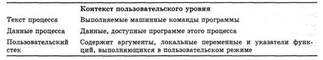
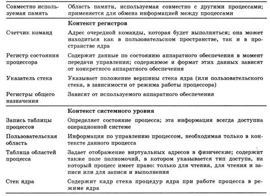
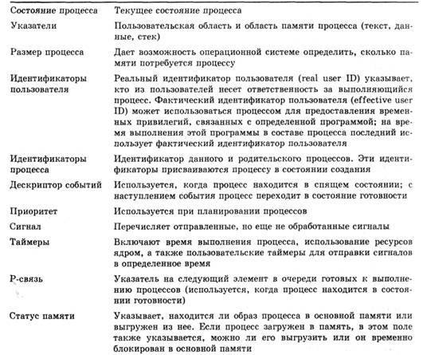
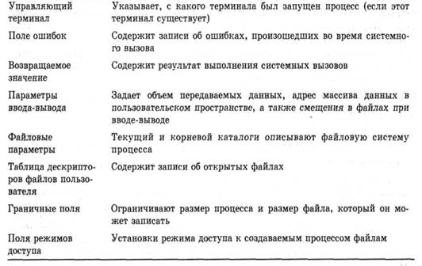

# Что такое процесс

*Что такое процесс. Что такое сигнал. Примеры perl-кода: создание процесса, передача процессу сигналов. Что такое сигналы. Функции fork, exec, wait, waitpid. Таблица процессов. Команды free, top, ps и другие.*

*Данная заметка - это просто компиляция материалов из нескольких источников, с целью сбора некоторой справочной информации, которую в дальнейшем можно использовать как шпаргалку. Использованные источники указаны в конце заметки.*

## Что такое процесс. Определение

Процесс в Linux (как и в UNIX) - это программа, которая выполняется в отдельном виртуальном адресном пространстве.

Каждый процесс выполняется в собственном виртуальном адресном пространстве, т.е. процессы защищены друг от друга и крах одного процесса никак не повлияет на другие выполняющиеся процессы и на всю систему в целом. Один процесс не может прочитать что-либо из памяти (или записать в нее) другого процесса без "разрешения" на то другого процесса. Санкционированные взаимодействия между процессами допускаются системой.

Ядро предоставляет системные вызовы для создания новых процессов и для управления порожденными процессами. Любая программа может начать выполняться только если другой процесс ее запустит или произойдет какое-то прерывание (например, прерывание внешнего устройства).

Для создания процессов используются два системных вызова: <font color="#00aa00">fork</font> и <font color="#00aa00">exec</font>. <font color="#00aa00">Fork</font> создает новое адресное пространство, которое полностью идентично адресному пространству основного процесса. После выполнения этого системного вызова мы получаем два абсолютно одинаковых процесса - основной и порожденный.

Теперь, когда мы уже создали процесс, мы можем запустить программу с помощью вызова <font color="#00aa00">exec</font>. Параметрами функции <font color="#00aa00">exec</font> является имя выполняемого файла и, если нужно, параметры, которые будут переданы этой программе. В адресное пространство порожденного с помощью <font color="#00aa00">fork</font> процесса будет загружена новая программа и ее выполнение начнется с точки входа (адрес функции main).

Пример кода:

```perl
if (fork()==0) wait(0);
else execl("ls", "ls", 0); /* порожденный процесс */
```

Теперь рассмотрим более подробно, что же делается при вызове <font color="#00aa00">fork</font>:
<ol>
 	<li>Выделяется память для описателя нового процесса в таблице процессов</li>
 	<li>Назначается идентификатор процесса PID</li>
 	<li>Создается логическая копия процесса, который выполняет <font color="#00aa00">fork</font> - полное копирование содержимого виртуальной памяти родительского процесса</li>
 	<li>Увеличиваются счетчики открытия файлов (порожденный процесс наследует все открытые файлы родительского процесса)</li>
 	<li>Возвращается PID в точку возврата из системного вызова в родительском процессе и 0 - в процессе-потомке.</li>
</ol>
Для нормального завершение процесса используется вызов

```perl
exit(status);
```

где <font color="#00aa00">status</font> - это целое число, возвращаемое процессу-предку для его информирования о причинах завершения процесса-потомка.


### Примеры perl кода

**Пример 1**

Простой пример создания дочернего процесса, с помощью <font color="#00aa00">fork</font>:

```perl
use strict;

my $pid;

if (!defined($pid = fork())) {
  die "cannot fork: $!";

} elsif ($pid) {
  # я — родительский процесс
  print "I am parent $pid ".$."\n";

} else {
  # я — порожденннй процесс 
  print "I am child $pid ".$."\n";
  exec("echo", "wow!");
  print "Never print\n";
}

exit;
```

Функция <font color="#00aa00">fork</font> в Perl работает, передавая свою работу системному вызову <font color="#00aa00">fork</font>.

<font color="#00aa00">Fork</font> возвращает PID дочернего процесса порождающему процессу. А дочерний получит значение "0". Это можно использовать, чтобы понять, в каком процессе выполняется работа. Если по каким-то причинам, новый процесс не может быть создан, например, не хватает системных ресурсов, функция вернет <font color="#00aa00">undef</font>.

После создания, дочерний процесс является копией родительского. Дескрипторы файлов будут использоваться совместно.

Функция <font color="#00aa00">exec</font> прекращает выполнение текущей программы и заменяет ее выполнением другой. К текущему коду процесс больше не вернется. Возврат из функции <font color="#00aa00">exec</font> возможен только в том случае, если указанной программы не существует и выполнить ее невозможно. В этом случае, надо проверить <font color="#00aa00">$!</font> , где будет записан код произошедшей ошибки.

Если вызов новой программы прошел благополучно, следует иметь ввиду, что код, который был расположен после <font color="#00aa00">exec</font>, выполнен не будет. Не будут выполнены так же и блоки<font color="#00aa00">END</font>, <font color="#00aa00">DESTROY</font>.

Результат выполнения примера:
<pre>
# perl ipc.pl
I am parent -2400 3664
I am child 0 -2400
wow!
</pre>
&nbsp;

**Пример 2**

Пример использования функции <font color="#00aa00">system</font> :

```perl
use strict;

my $pid;

if (!defined($pid = fork())) {
  die "cannot fork: $!";

} elsif ($pid) {
  # я — родительский процесс
  print "I am parent $pid ".$."\n";

} else {
  # я — порожденннй процесс 
  print "I am child $pid ".$."\n";
  system("echo", "wow!");
  print "Never print\n";
}

exit;
```

<font color="#00aa00">System</font> так же как и <font color="#00aa00">exec</font>, выполняет любую программу в системе. От <font color="#00aa00">exec</font> отличается тем, что после выполнения программы возвращает управление в ту точку, откуда была вызвана функция.

Чтобы выполнить свою работу, <font color="#00aa00">system</font> выполняет собственный <font color="#00aa00">fork</font>, затем <font color="#00aa00">exec</font>, затем дожидается завершения работы порожденного процесса.
<pre>
# perl ipc2.pl
I am parent -2452 2084
I am child 0 -2452
wow!
Never print
</pre>
&nbsp;

**Пример 3**

Чтобы избежать ситуаций, когда родительский процесс умирает раньше детеныша, и возникает маленький "зомби", следует писать программу таким образом, чтобы процесс-родитель всегда дожидался окончания работы детеныша. Для этого можно использовать функции <font color="#00aa00">wait</font> и <font color="#00aa00">waitpid</font>.

Функция <font color="#00aa00">wait</font> ждет завершения дочернего процесса и возвращает PID завершенного процесса, либо -1, если дочерних процессов нет.

Функция <font color="#00aa00">waitpid</font> ожидает завершения конкретного дочернего процесса. Возвращает PID завершенного процесса или -1.

```perl
use strict;

my $pid;

if (!defined($pid = fork())) {
  die "cannot fork: $!";

} elsif ($pid) {
  # я — родительский процесс
  print "I am parent $pid $ \n";

} else {
  # я — порожденннй процесс 
  print "I am child $pid $ \n";
  exec("echo", "wow!");
  print "Never print\n";
}

waitpid($pid, 0);
print "Parent process $ \n";
exit;
```

Результат работы скрипта:
<pre>
# perl ipc2.pl
I am parent -2688 2684
I am child 0 -2688
wow!
Parent process 2684
</pre>


## Содержимое элемента таблицы процессов

В операционной системе UNIX процессы представлены довольно сложными структурами данных, которые предоставляют операционной системе всю необходимую для управления и диспетчеризации процессов информацию.

Образ процесса в UNIX:



</a>

Пример содержимого элемента таблицы процессов в системе UNIX






## Сигналы

Сигнал - способ информирования процесса ядром о происшествии какого-то события. Каждый процесс реагирует на сигналы и может установить собственную реакцию на сигналы, производимые операционной системой.

Установить реакцию на поступление сигнала можно с помощью системного вызова <font color="#00aa00">signal</font>:

```perl
func = signal(snum, function);
```

<font color="#00aa00">snum</font> - номер сигнала, а <font color="#00aa00">function</font> - адрес функции, которая должна быть выполнена при поступлении указанного сигнала. Возвращаемое значение - адрес функции, которая будет реагировать на поступление сигнала. Вместо <font color="#00aa00">function</font> можно указать ноль или единицу. Если был указан ноль, то при поступлении сигнала <font color="#00aa00">snum</font> выполнение процесса будет прервано аналогично вызову
<font color="#00aa00">exit</font>. Если указать единицу, данный сигнал будет проигнорирован, но это возможно не для всех процессов.

С помощью системного вызова <font color="#00aa00">kill</font> можно сгенерировать сигналы и передать их другим процессам.

```perl
kill(pid, snum); 
```

**Номера сигналов**

<table width="100%">
<tbody>
<tr>
<td>Номер</td>
<td>Название</td>
<td>Описание</td>
</tr>
<tr>
<td>01</td>
<td>SIGHUP&nbsp;</td>
<td>Освобождение линии (hangup).</td>
</tr>
<tr>
<td>02</td>
<td>SIGINT</td>
<td>Прерывание (interrupt).&nbsp;</td>
</tr>
<tr>
<td>03</td>
<td>SIGQUIT</td>
<td>Выход (quit).&nbsp;</td>
</tr>
<tr>
<td>04</td>
<td>SIGILL</td>
<td>Некорректная команда (illegal instruction). Не переустанавливается при перехвате.&nbsp;</td>
</tr>
<tr>
<td>05</td>
<td>SIGTRAP</td>
<td>Трассировочное прерывание (trace trap). Не переустанавливается при перехвате.</td>
</tr>
<tr>
<td>06</td>
<td>SIGIOT или SIGABRT</td>
<td>Машинная команда IOT.&nbsp;</td>
</tr>
<tr>
<td>07</td>
<td>SIGEMT</td>
<td>Машинная команда EMT.&nbsp;</td>
</tr>
<tr>
<td>08</td>
<td>SIGFPE</td>
<td>Исключительная ситуация при выполнении операции с вещественными числами (floating-point exception)</td>
</tr>
<tr>
<td>09</td>
<td>SIGKILL</td>
<td>Уничтожение процесса (kill). Не перехватывается и не игнорируется.</td>
</tr>
<tr>
<td>10</td>
<td>SIGBUS</td>
<td>Ошибка шины (bus error).</td>
</tr>
<tr>
<td>11</td>
<td>SIGSEGV</td>
<td>Некорректное обращение к сегменту памяти (segmentation violation).</td>
</tr>
<tr>
<td>12</td>
<td>SIGSYS</td>
<td>Некорректный параметр системного вызова (bad argument to system call).</td>
</tr>
<tr>
<td>13</td>
<td>SIGPIPE</td>
<td>Запись в канал, из которого некому читать (write on a pipe with no one to read it).</td>
</tr>
<tr>
<td>14</td>
<td>SIGALRM</td>
<td>Будильник&nbsp;</td>
</tr>
<tr>
<td>15</td>
<td>SIGTERM&nbsp;</td>
<td>Программный сигнал завершения</td>
</tr>
<tr>
<td>16</td>
<td>SIGUSR1</td>
<td>Определяемый пользователем сигнал 1</td>
</tr>
<tr>
<td>17</td>
<td>SIGUSR2</td>
<td>Определяемый пользователем сигнал 2&nbsp;</td>
</tr>
<tr>
<td>18</td>
<td>SIGCLD</td>
<td>Завершение порожденного процесса (death of a child).</td>
</tr>
<tr>
<td>19</td>
<td>SIGPWR</td>
<td>Ошибка питания</td>
</tr>
<tr>
<td>22</td>
<td></td>
<td>Регистрация выборочного события</td>
</tr>
</tbody>
</table>

Сигналы (точнее их номера) описаны в файле <font color="#00aa00">signal.h</font>

### Примеры perl кода

**Пример 1**

В Perl применяется простая модель обработки сигналов. Существует хэш <font color="#00aa00">%SIG</font>, который содержит ссылки на определенные пользователем обработчики сигналов.

После того, как происходит некоторое событие, операционная система доставляет сигнал процессу, который имеет отношение к произошедшему событию. Вызывается обработчик события, который получает на вход один аргумент - название запустившего его сигнала. Для отправки сигнала другому процессу можно использовать функцию <font color="#00aa00">kill</font>. Отправителю сигнала никаких данных не возвращается.

```perl
use strict;

sub quit_handler {
    print "Bye!\n";
    die;
}

$SIG{INT} = \&quit_handler;
$SIG{QUIT} = \&quit_handler;

sleep(15);

exit;
```

Если во время выполнения программы, нажать Ctrl+C - программа немедленно завершится и выведет сообщение "Bye!".

Некоторые сигналы нельзя перехватить или игнорировать, например KILL и STOP.

**Пример 2**

Пример использования функции <font color="#00aa00">kill</font> :

```perl
use strict;

sub quit_handler {
    print "Bye!\n";
    die;
}

$SIG{INT} = \&quit_handler;
$SIG{QUIT} = \&quit_handler;

my $pid;

if (!defined($pid = fork())) {
  die "cannot fork: $!";

} elsif ($pid) {
  # я — родительский процесс
  print "I am parent $pid $ \n";

} else {
  # я — порожденннй процесс.
  print "I am child $pid $ \n";
  sleep(15);
  print "Never print\n";
}

if ($pid) {
  # я — родительский процесс
  kill('INT', $pid);
  print("kill child process");
}.

waitpid($pid, 0);
exit;
```

В данной задачке, родительский процесс создает детеныша. Детеныш засыпает, а коварный родитель в это время отправляет ему сигнал на прерывание работы. Детеныш завершает свою работу, после чего это же делает и родитель.

Можно использовать <font color="#00aa00">kill</font> для того, что бы проверить, жив ли процесс до сих пор. Для этого можно отправить нужному процессу сигнал "0".

<font color="#00aa00">Kill</font> работает по разному в unix и windows системах. Это надо учитывать.

## Как получить данные о процессе

### ps

Команда <font color="#00aa00">ps</font> предназначена для вывода информации о выполняемых процессах.

Поиск процессов httpd:

<pre>ps -f | grep httpd</pre>

Вывод списка процессов для пользователя root:

<pre>ps -u root -f
UID        PID  PPID  C STIME TTY          TIME CMD
root     17705 17703  0 02:28 pts/1    00:00:00 bash -rcfile .bashrc
root     18091 17705  0 04:50 pts/1    00:00:00 ps -f
</pre>

### top

Команда предназначена для вывода информации о процессах в реальном времени. Процессы сортируются по максимальному занимаемому процессорному времени, но порядок сортировки можно изменить. Программа также сообщает о свободных системных ресурсах.
<pre>
top - 04:51:39 up 269 days, 18:36,  1 user,  load average: 0,00, 0,00, 0,00
Tasks:  44 total,   1 running,  43 sleeping,   0 stopped,   0 zombie
%Cpu(s):  0,0 us,  0,0 sy,  0,0 ni,100,0 id,  0,0 wa,  0,0 hi,  0,0 si,  0,0 st
KiB Mem:    262144 total,   101984 used,   160160 free,        0 buffers
KiB Swap:        0 total,        0 used,        0 free,    25948 cached

  PID USER      PR  NI  VIRT  RES  SHR S  %CPU %MEM    TIME+  COMMAND
    1 root      20   0  3136  552   84 S   0,0  0,2   0:05.31 init
    2 root      20   0     0    0    0 S   0,0  0,0   0:00.00 kthreadd/884023
    3 root      20   0     0    0    0 S   0,0  0,0   0:00.00 khelper/8840231
    4 root      20   0     0    0    0 S   0,0  0,0   0:00.00 rpciod/8840231/
    5 root      20   0     0    0    0 S   0,0  0,0   0:00.00 rpciod/8840231/
    6 root      20   0     0    0    0 S   0,0  0,0   0:00.00 rpciod/8840231/
</pre>

### free

Команда <font color="#00aa00">free</font> в Linux предоставляет информацию об общем использовании доступного пространства физической памяти и подкачки памяти.

<pre>$ free
             total       used       free     shared    buffers     cached
Mem:        262144     101736     160408          0          0      25952
-/+ buffers/cache:      75784     186360
Swap:            0          0          0
</pre>

### df

Утилита в UNIX и UNIX-подобных системах, показывает список всех файловых систем по именам устройств, сообщает их размер, занятое и свободное пространство и точки монтирования.
<pre>
$ df
Файловая система 1K-блоков Использовано Доступно Использовано% Cмонтировано в
/dev/simfs         7340032      2998684  4341348           41% /
none              24643836            4 24643832            1% /dev
none              24643836          996 24642840            1% /run
none              24643836            0 24643836            0% /run/lock
none              24643836            0 24643836            0% /run/shm
none              24643836            0 24643836            0% /run/user
</pre>

### w
Информация о зарегистрированных в системе пользователей.

<pre>$ w
 04:53:39 up 269 days, 18:38,  1 user,  load average: 0,00, 0,00, 0,00
USER     TTY      FROM             LOGIN@   IDLE   JCPU   PCPU WHAT
root     pts/0    ppp91-79-9-111.p 02:28    0.00s  0.58s  0.58s mc
</pre>

### nohup

<font color="#00aa00">nohup</font> - игнорирование сигналов прерывания
<pre>nohup команда [аргумент]</pre>

<font color="#00aa00">nohup</font> выполняет запуск команды в режиме игнорирования сигналов. Не игнорируются только сигналы SIGHUP и SIGQUIT.

Команда <font color="#00aa00">nohup</font> используется для запуска команды, которая будет игнорировать сигналы и добавлять потоки STDOUT и STDERR в файл. По умолчанию, этим файлом является либо <font color="#00aa00">nohup.out</font>, либо <font color="#00aa00">$HOME/nohup.out</font>.

Команда <font color="#00aa00">nohup</font> позволяет процессам продолжать свою работу даже после того, как вы вышли из системы.

Можно использовать <font color="#00aa00">nohup</font> для запуска команды в фоновом режиме.

### kill

<font color="#00aa00">kill</font> - отправка сигнала процессу. Чаще всего используется
для принудительного завершения процесса.
<pre>kill [-номер сигнала] PID</pre>
где PID - идентификатор процесса, который можно узнать с помощью команды <font color="#00aa00">ps</font>. Пример:

<pre># kill -9 6766</pre>

### &amp;

Знак амперсанда можно использовать для запуска процесса в фоновом режиме:
<pre>$ perl script/vkino_server.pl -p 3000 -r 2&gt;~/server_log &amp;</pre>

### uptime

Команда <font color="#00aa00">uptime</font> показывает строку со следующей информацией: текущее время, время непрерывной работы системы, количество подключенных пользователей и средняя загрузка системы за последние 1, 5 и 15 минут.
<pre>$ uptime
 05:08:34 up 269 days, 18:52,  1 user,  load average: 0,00, 0,00, 0,00
</pre>

