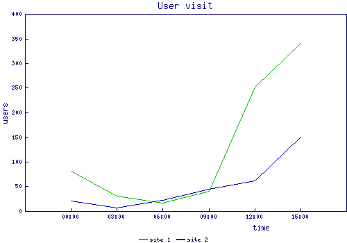
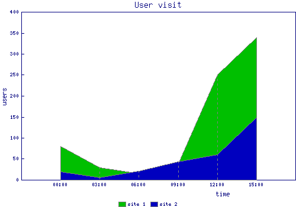
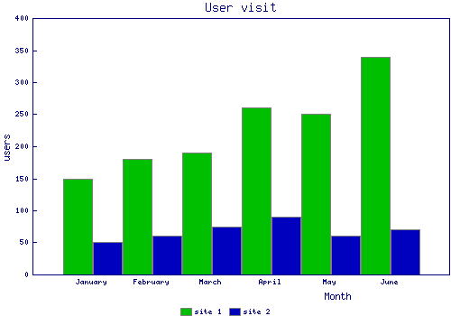
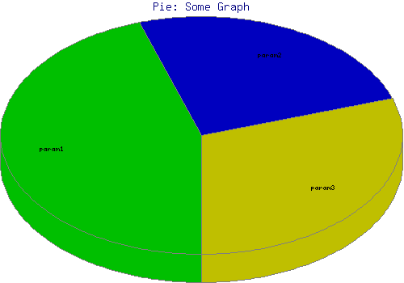
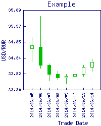
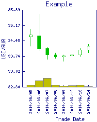
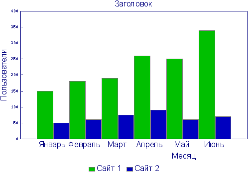

# Как нарисовать диаграмму с помощью GD::Graph и perl

*Заметки о создании диаграмм с помощью perl и GD::Graph. Примеры кода. Примеры создания диаграмм для фондового рынка.*

Все примеры протестированы в windows-среде. Я не ставила перед собой цели создать объемное руководство по <font color="#00aa00">GD::Graph</font>, поэтому ниже в основном только примеры кода.

### Линейные диаграммы

Можно выбрать несколько вариантов отрисовки линейных диаграмм:
<ul>
<li>просто линия на графике (модуль <font color="#00aa00">GD::Graph::lines</font>),</li>
<li>линия на графике с заливкой (<font color="#00aa00">GD::Graph::area</font>),</li>
<li>линия на графике с обозначением точек (<font color="#00aa00">GD::Graph::linespoints</font>),</li>
<li>только точки на графике, без линии (<font color="#00aa00">GD::Graph::points</font>).</li>
</ul>

```perl
#!/usr/bin/perl
 
use strict;
use GD::Graph::lines;
 
# we create some data
my @time    = ('00:00', '03:00', '06:00', '09:00', '12:00', '15:00'); 
my @site1   = (    80 ,     30 ,     15 ,     40 ,    250 ,    340 );
my @site2   = (    20 ,      5 ,     21 ,     43 ,     60 ,    150 );
my @data = (\@time, \@site1, \@site2);
 
# configuration for line graph
my %config = (
    title           => 'User visit',
    x_label         => 'time',
    y_label         => 'users',
    dclrs           => [ ('green', 'blue') ],
    x_label_skip    =>  1,
    y_label_skip    =>  1,
    y_tick_number   =>  8,
);
 
my $lineGraph = GD::Graph::lines->new(500, 350);
$lineGraph->set(%config) or warn $lineGraph->error;
$lineGraph->set_legend_font('GD::gdMediumNormalFont');
$lineGraph->set_legend('site 1', 'site 2');
 
my $lineImage = $lineGraph->plot(\@data) or die $lineGraph->error;
CreatePngFile($lineImage, 'lineGraph');
 
sub CreatePngFile {
    my $image = shift;
    my $fname = shift;
    open    (my $file, ">$fname.png") or die $!;
    binmode ($file);
    print    $file $image->png;
    close   ($file);
    return 1;
}
```



Логически, построение диаграммы с помощью <font color="#00aa00">GD::Graph</font> делится на три этапа:

<ol>
<li>Подготовка данных.</li>
<li>Создание объекта диаграммы, задание параметров будущего графика.</li>
<li>Создание диаграммы.</li>
</ol>

Метод <font color="#00aa00">new()</font> создает объект GD::Graph, тут же указывается размер будущего изображения графика в пикселях. Первое значение - ширина изображения, второе - его высота.

Метод <font color="#00aa00">set()</font> позволяет задать параметры будущего графика, например, цвета для линий диаграммы, правила отрисовки значений вдоль осей X и Y, подписи к каждой из осей, заголовок диаграммы и т.п.

Метод <font color="#00aa00">plot()</font> - строит график и возвращает объект GD, который можно использовать для создания png или gif-изображения. Метод ожидает в качестве аргумента ссылку на массив, который содержит в качестве первого элемента - ссылку на массив значений оси X. В качестве второго элемента - ссылка на массив со значениями для оси Y. Может быть передано более двух массивов. Данные третьего и других дополнительных массивов так же будут использоваться для отрисовки по оси Y других графиков.

При этом, не обязательно указывать значение для каждой точки графика. Если значение не известно, можно использовать undef.

Чтобы получить диаграмму с цветной заливкой, надо в вышеприведенном коде всего лишь заменить строки с "<font color="#00aa00">GD::Graph::lines</font>" на "<font color="#00aa00">GD::Graph::area</font>".



Тоже самое для "<font color="#00aa00">GD::Graph::linespoints</font>" и "<font color="#00aa00">GD::Graph::points</font>".


### Столбчатая диаграмма

Вертикальная столбчатая диаграмма реализуется с помощью модуля <font color="#00aa00">GD::Graph::bars</font>, горизонтальная столбчатая диаграмма с помощью - <font color="#00aa00">GD::Graph::hbars</font>.

Принцип отрисовки столбчатой диаграммы, такой же как и линейной. Меняется только вызываемый модуль. Однако, ниже будет приведен код реализации столбчатой диаграммы в примере про русификацию.



### Круговая диаграмма

Круговые диаграммы рисуются с помощью модуля <font color="#00aa00">GD::Graph::pie</font>.

```perl
#!/usr/bin/perl
 
use strict;
use GD::Graph::pie;
 
my @params   = ('param1', 'param2', 'param3');
my @values   = (     45 ,      25 ,      30 );

my @data = (\@params, \@values);
my $pieGraph = GD::Graph::pie->new(500, 350);
$pieGraph->set( 
    title        => "Pie: Some Graph",
    transparent  => 1,
    "3d"         => 1,
    dclrs           => [ ('green', 'blue', 'yellow') ],
); 
my $pieImage = $pieGraph->plot(\@data) or die $pieGraph->error;
CreatePngFile($pieImage, 'pieGraph');
 
sub CreatePngFile {
    my $image = shift;
    my $fname = shift;
    open    (my $file, ">$fname.png") or die $!;
    binmode ($file);
    print    $file $image->png;
    close   ($file);
    return 1;
}
```



### Диаграммы для любителей биржевой торговли и форекса, "свечи"

"Свечи" мне нравятся больше "баров", я считаю их более удобными для восприятия информации. Поэтому, ниже приводится пример диаграммы со свечами.

```perl
use strict;
use warnings;
use List::Util qw(min max);
use GD::Graph::candlesticks;

my @msft = (     
    #              open     high     low      close
    ["2014/06/05", "34.64", "35.00", "34.21", "34.74"],
    ["2014/06/06", "34.69", "35.69", "34.00", "34.10"],
    ["2014/06/07", "34.10", "34.15", "33.60", "33.80"],
    ["2014/06/08", "33.80", "33.90", "33.65", "33.70"],
    ["2014/06/09", "33.70", "33.80", "33.50", "33.75"],
    ["2014/06/12", "33.75", "33.80", "33.75", "33.80"],
    ["2014/06/13", "33.80", "34.10", "33.74", "34.03"],
    ["2014/06/14", "34.03", "34.30", "33.90", "34.20"],
);

my @all_points = map {@$_[1 .. 4]} @msft;
my $min_point  = min(@all_points);
my $max_point  = max(@all_points);
my $graph = GD::Graph::candlesticks->new(200, 250);

$graph->set(
    x_labels_vertical => 1,
    x_label           => 'Trade Date',
    y_label           => 'USD/RUR',
    title             => "Example",
    transparent       => 0,
    candlestick_width => 7,
    dclrs             => [qw(green)],
    y_min_value       => $min_point-0.2,
    y_max_value       => $max_point+0.2,
    y_number_format   => '%0.2f',
) or warn $graph->error;

my $data_candlesticks = [
    [ map {$_->[0]} @msft ],       # date
    [ map {[@$_[1 .. 4]]} @msft ], # candlesticks
];

my $lineImage = $graph->plot($data_candlesticks) or die $graph->error;
CreatePngFile($lineImage, 'candle2');

sub CreatePngFile {
    my $image = shift;
    my $fname = shift;
    open    (my $file, ">$fname.png") or die $!;
    binmode ($file);
    print    $file $image->png;
    close   ($file);
    return 1;
}
```



### Создание смешанных типов диаграмм с помощью GD::Graph::mixed
Наверняка, многие из тех, кто занимается рынками, используют различные индикаторы и параметры объема торговли. Внешне это выглядит как раз, как несколько разных типов диаграмм в одном окне. Например, график свечей + линейные графики (стохастические индикаторы), или свечи + столбчатые диаграммы (объем), ну и т.п. Ниже пример, как реализовать подобный график с помощью <font color="#00aa00">GD::Graph::mixed</font>. Пример кода:

```perl
use strict;
use warnings;
use List::Util qw(min max);
use GD::Graph::candlesticks;
use GD::Graph::mixed;

my @msft = (     
    #              open     high     low      close
    ["2014/06/05", "34.64", "35.00", "34.21", "34.74"],
    ["2014/06/06", "34.69", "35.69", "34.00", "34.10"],
    ["2014/06/07", "34.10", "34.15", "33.60", "33.80"],
    ["2014/06/08", "33.80", "33.90", "33.65", "33.70"],
    ["2014/06/09", "33.70", "33.80", "33.50", "33.75"],
    ["2014/06/12", "33.75", "33.80", "33.75", "33.80"],
    ["2014/06/13", "33.80", "34.10", "33.74", "34.03"],
    ["2014/06/14", "34.03", "34.30", "33.90", "34.20"],
);

my @all_points = map {@$_[1 .. 4]} @msft;
my $min_point  = min(@all_points);
my $max_point  = max(@all_points);
my $min_point_line = $min_point-1.2; 

my @volume = (
    $min_point_line+0.10, $min_point_line+0.30, 
    $min_point_line+0.40, $min_point_line+0.09, 
    $min_point_line+0.05, $min_point_line+0.07, 
    $min_point_line+0.09, $min_point_line+0.02
);

my $graph = GD::Graph::mixed->new(200, 250);

$graph->set(
    x_labels_vertical => 1,
    x_label           => 'Trade Date',
    y_label           => 'USD/RUR',
    title             => "Example",
    transparent       => 0,
    dclrs             => [qw(green yellow)],
    y_min_value       => $min_point_line,
    y_max_value       => $max_point+0.2,
    y_number_format   => '%0.2f',
    types             => [ "candlesticks", "bars"  ],

) or warn $graph->error;

my $data_candlesticks = [
    [ map {$_->[0]} @msft ],       # date
    [ map {[@$_[1 .. 4]]} @msft ], # candlesticks,
    \@volume,                       # bars
];

my $lineImage = $graph->plot($data_candlesticks) or die $graph->error;
CreatePngFile($lineImage, 'candle3');

sub CreatePngFile {
    my $image = shift;
    my $fname = shift;
    open    (my $file, ">$fname.png") or die $!;
    binmode ($file);
    print    $file $image->png;
    close   ($file);
    return 1;
}
```

Параметр <font color="#00aa00">types</font> при установке параметров будущей диаграммы, указывает очередность отрисовки разных типов диаграмм.



### Русские буквы на диаграммах GD::Graph

Попробовала разные решения, которые предлагаются в интернете, у меня заработало только одно из них.

```perl
#!/usr/bin/perl
 
use strict;
use GD::Graph::bars;

my @time = (
    stringToDec('Январь'), 
    stringToDec('Февраль'), 
    stringToDec('Март'), 
    stringToDec('Апрель'), 
    stringToDec('Май'), 
    stringToDec('Июнь')
); 
my @site1   = ( 150, 180, 190, 260, 250, 340 );
my @site2   = ( 50, 60, 75, 90, 60, 70 );
my @data = (\@time, \@site1, \@site2);
 
my %config = (
    title           => stringToDec('Заголовок'),
    x_label         => stringToDec('Месяц'),
    y_label         => stringToDec('Пользователи'),
    dclrs           => [ ('green', 'blue') ],
    x_label_skip    =>  1,
    y_label_skip    =>  1,
    y_tick_number   =>  8,
);
 
my $barsGraph = GD::Graph::bars->new(500, 350);

$barsGraph->set_x_label_font('C:/WINDOWS/Fonts/arial.ttf', 12);
$barsGraph->set_y_label_font('C:/WINDOWS/Fonts/arial.ttf', 12);
$barsGraph->set_legend_font('C:/WINDOWS/Fonts/arial.ttf', 12);
$barsGraph->set_title_font('C:/WINDOWS/Fonts/arial.ttf', 12);
$barsGraph->set_x_axis_font('C:/WINDOWS/Fonts/arial.ttf', 12);
$barsGraph->set_values_font('C:/WINDOWS/Fonts/arial.ttf', 12);
$barsGraph->set(%config) or warn $barsGraph->error;
$barsGraph->set_legend(stringToDec('Сайт 1'), stringToDec('Сайт 2'));
my $barsImage = $barsGraph->plot(\@data) or die $barsGraph->error;
 
CreatePngFile($barsImage, 'rusbars');
 
sub CreatePngFile {
    my $image = shift;
    my $fname = shift;
    open    (my $file, ">$fname.png") or die $!;
    binmode ($file);
    print    $file $image->png;
    close   ($file);
    return 1;
}
 
sub stringToDec{
    my $ustring = '';
    for my $char (split //, shift){
        if(ord($char)>127){
            $ustring .= "&amp;#" . (unpack("U", $char)+848) . ";";
        }else{
            $ustring .= $char;
        }
    }
    return $ustring;
} 
```

Стандартные шрифты GD не русифицированы, вместо них следует использовать русифицированные ttf шрифты, я взяла <font color="#00aa00">arial.ttf</font>. Дополнительные преобразования нужны, чтобы передать модулю GD::Graph латиницу в виде десятичных значений символов в Unicode - как ему это необходимо.



