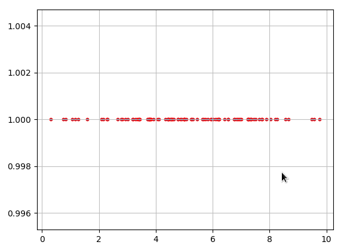

# Генерация псевдослучайных чисел. Модуль random

*Скрипты выполнялись под Python версии 2.7.9.*

Генерация случайных чисел используется для:
<ul>
<li>создания идентификаторов сессий,</li>
<li>создания токенов (CSRF и т.п.),</li>
<li>создания произвольных паролей и кодов доступа,</li>
<li>создания произвольных последовательностей данных в играх,</li>
<li>создания уникальных номеров для маркетинговых акций (подарочные карты, розыгрыш призов по коду и т.п.).</li>
</ul>

В Python существует несколько основных модулей и классов, связанных с генерацией псевдослучайных чисел:
<ul>
<li>_random - реализует алгоритм Mersenne Twister, написан на языке C;</li>
<li>класс Random - наследует _random, написан на языке Python;</li>
<li>модуль os - предоставляет доступ к внешнему источнику случайных чисел, в случае Linux - это /dev/urandom;</li>
<li>класс SystemRandom наследует Random, но для генерации случайных чисел обращается к os.urandom;</li>
<li>класс WichmannHill наследует Random, реализует алгоритм Вихмана-Хилла для генерации псевдослучайных чисел.</li>
</ul>
В качестве основного генератора псевдослучайных чисел Python использует Mersenne Twister, доступ к которому предоставляет класс Random. Mersenne Twister имеет период 2 ** 19937-1.  Это один из наиболее протестированных генераторов случайных чисел. Основная часть реализована на C. К сожалению, не подходит для криптографических задач.

В целях криптографической безопасности рекомендуется использовать класс SystemRandom и функцию os.urandom().

Mersenne Twister заменил ранее используемый алгоритм WichmannHill. WichmannHill не соответствует современным требованиям безопасности.


## Модуль random

Найти файл модуля:
<pre>&gt;&gt;&gt; import sys
&gt;&gt;&gt; import random
&gt;&gt;&gt; random.__file__
'/usr/lib/python2.7/random.pyc'
</pre>
И посмотреть содержимое модуля (для особо любопытных):
<pre>less /usr/lib/python2.7/random.py</pre>

Прежде чем использовать модуль, необходимо подключить его с помощью инструкции:
<pre>import random</pre>

### Функции модуля random, генерирующие вещественнозначное распределение

Следующие функции генерируют конкретные вещественнозначные распределения.

#### random.random()

Функция random() возвращает псевдослучайное число с плавающей точкой в диапазоне от 0.0 до 1.0.
<pre>&gt;&gt;&gt; random.random()
0.06256127953414425
</pre>
Если необходимо получить число из большего диапазона, например, от 0 до 10, можно умножить результат функции на 10.

#### random.uniform(start, stop)

Функция uniform() возвращает псевдослучайное вещественное число в указанном диапазоне от start до stop включительно.
<pre>&gt;&gt;&gt; import random
&gt;&gt;&gt; random.uniform(10, 20)
17.37931908042495
</pre>

#### random.triangular(low, high, mode)

Функция triangular() — возвращает псевдослучайное число N с плавающей точкой: low &lt;= N &lt;= high. По умолчанию нижняя и верхняя границы диапазона равны нулю и единице.
<pre>&gt;&gt;&gt; random.triangular(1,3,2)
2.01309302239846
</pre>
Параметр mode по умолчанию задает среднюю точку между указанными границами, предоставляя симметричное распределение:
```python
# -*- coding: utf-8 -*-

import matplotlib.pyplot as plt
import random

x = [random.triangular(0,10,5) for i in range(-50, 50)]
y = [1 for i in range(-50,50)]

plt.scatter(x, y, edgecolors='r', s=10)
plt.grid(True, linestyle='-', color='0.75')
plt.show()
```

Отобразить результаты triangular() на графике:



Функция triangular() появилась в Python 2.6.

#### random.betavariate(alpha, beta)

Функция betavariate() — бета-распределение. Условия по параметрам: alpha &gt; 0 и beta &gt; 0. Возвращает значения от 0 до 1.

#### random.expovariate(lambd)

Функция expovariate() — экспоненциальное распределение. lambd равен 1.0, деленное на желаемое среднее значение. Lambd не должен быть равен нулю. Возвращаемые значения от 0 до плюс бесконечности, если lambd положительно, и от минус бесконечности до 0, если lambd отрицательный.
```python
# -*- coding: utf-8 -*-

import matplotlib.pyplot as plt
import random

x = [random.expovariate(0.5) for i in range(-50, 50)]
y = [1 for i in range(-50,50)]

plt.scatter(x, y, edgecolors='r', s=10)
plt.grid(True, linestyle='-', color='0.75')
plt.show()
```

Показать результаты expovariate() графически:


#### random.gammavariate(alpha, beta)

Гамма-распределение. Условия по параметрам: alpha &gt; 0 и beta &gt; 0.

#### random.gauss(mu, sigma)

gauss() — Гауссовское распределение. mu - среднее значение, а sigma - стандартное отклонение. Работает быстрее, чем normalvariate().

#### random.lognormvariate(mu, sigma)

lognormvariate() — логнормальное распределение. Если вы возьмете натуральный логарифм этого распределения, вы получите нормальное распределение со средней сигмой mu и стандартным
отклонением. mu может иметь любое значение, а sigma должна быть больше нуля.

#### random.normalvariate(mu, sigma)

normalvariate() — нормальное распределение. mu — среднее значение, sigma — стандартное отклонение.

#### random.vonmisesvariate(mu, kappa)

Распределение фон Мизеса. mu - средний угол, выраженный в радианах от 0 до 2 * pi, а kappa - параметр концентрации, который должен быть больше или равен нулю. Если kappa равна нулю, распределение сводится к равномерному случайному углу в диапазоне от 0 до 2 * pi.

#### random.paretovariate(alpha)

Распределение Парето. alpha - параметр формы.

#### random.weibullvariate(alpha, beta)

Распределение Вейбулла. alpha - параметр масштаба, а beta - параметр формы.

### Функции модуля random для работы с целыми числами

#### random.randrange(start, stop[, step])

Функция random.randrange() - возвращает случайно выбранное целое число из строго заданного диапазона значений. Функция может принимать от одного до трех аргументов.
<ul>
<li>randrange(stop) - случайное число будет выбираться из диапазона значений от нуля до числа stop.</li>
<li>randrange(start, stop) - диапазон возможных значений от числа start до числа stop.</li>
<li>randrange(start, stop, step) - выборка случайного целого числа происходит от числа start до числа stop с шагом step.</li>
</ul>
Пример:
<pre>&gt;&gt;&gt; from random import randrange
&gt;&gt;&gt; randrange(10) # значение будет выбрано из диапазона чисел от 0 до 9
3
&gt;&gt;&gt; randrange(5,10) # значение будет выбрано из чисел 5, 6, 7, 8, 9
7
&gt;&gt;&gt; randrange(6,10,2) # значение будет выбрано из чисел 6, 8
6
</pre>
Функция появилась в Python 1.5.2.

Результат вызова randrange(start, stop, step) эквивалентен вызову функции choice(range(start, stop, step)).

#### random.randint(min, max)

Функция randint(min, max) возвращает случайное целое число в интервале от min до max.
<pre>&gt;&gt;&gt; import random
&gt;&gt;&gt; random.randint(10,15)
13
</pre>

### Функции модуля random для последовательностей

#### random.shuffle(seq[, random])

Для работы со списками в модуле random определены две функции: shuffle() и choice().
Функция shuffle() перемешивает список случайным образом, а функция choice() возвращает один случайный элемент из списка.

При перемешивании изменяется сам список, поэтому функция работает только с изменяемыми и упорядоченными (индексируемыми) типами данных.
<ul>
<li>seq - список, подлежащий взбалтыванию,</li>
<li>random - необязательный аргумент, функция, возвращающая случайный float в интервале от 0.0 до 1.0. По умолчанию используется функция random().</li>
</ul>
Пример:
<pre>&gt;&gt;&gt; import random
&gt;&gt;&gt; numbers = [1,2,3,4,5,6]
&gt;&gt;&gt; random.shuffle(numbers)
&gt;&gt;&gt; print numbers
[2, 1, 5, 3, 4, 6]
</pre>
Указываем вместо random(), используемую по умолчанию, иную функцию. Тут приведен примитивнейший вариант, просто для примера:
<pre>&gt;&gt;&gt; from random import shuffle
&gt;&gt;&gt; def rand():
...     return 0.1
...
&gt;&gt;&gt; arr=[1,2,3]
&gt;&gt;&gt; shuffle(arr,rand)
&gt;&gt;&gt; print arr
[2, 3, 1]
&gt;&gt;&gt; shuffle(arr,rand)
&gt;&gt;&gt; print arr
[3, 1, 2]
</pre>

#### random.choice(seq)

Функция choice() - возвращает случайный элемент из любой непустой последовательности (строка, кортеж, список). Только упорядоченные (индексируемые) последовательности.
<pre>&gt;&gt;&gt; from random import choice
&gt;&gt;&gt; a=(1,2,3,4)
&gt;&gt;&gt; b="abvgd"
&gt;&gt;&gt; c=[1,2,3,4,5,7]
&gt;&gt;&gt; choice(a)
3
&gt;&gt;&gt; choice(b)
'g'
&gt;&gt;&gt; choice(c)
2
</pre>
Если последовательность окажется пустой, будет инициирована IndexError.

#### random.sample(population, k)

Функция sample() возвращает список длиной k, созданный с помощью произвольной выборки элементов из последовательности population. Работает с кортежами, списками, множествами, словарями, строками.
<pre>&gt;&gt;&gt; from random import sample
&gt;&gt;&gt; a = [1,2,3,4,5,6,7]
&gt;&gt;&gt; sample(a,3)
[4, 3, 7]
&gt;&gt;&gt; b = (1,2,3,4,5)
&gt;&gt;&gt; sample(b,3)
[3, 4, 1]
&gt;&gt;&gt; c="mammamia"
&gt;&gt;&gt; sample(c,4)
['i', 'm', 'a', 'm']
&gt;&gt;&gt; d={1,3,5,6,7,8}
&gt;&gt;&gt; sample(d,3)
[3, 1, 6]
&gt;&gt;&gt; e={1: "a", 2: "b", 3: "c", 4: "d"}
&gt;&gt;&gt; sample(e,2)
[1, 3]
</pre>
Функция добавлена в Python 2.3.

### Прочие функции модуля random

#### random.seed()

Функция seed() - инициализация генератора случайных чисел, настройка на новую последовательность.
<pre>&gt;&gt;&gt; import random
&gt;&gt;&gt; random.seed()
</pre>
Данная функция имеет особое значение, когда генератор случайных чисел используется для обеспечения безопасности приложения, например, при генерации токенов, идентификаторов сессий. В некоторых фреймворках под Python инициализация генератора случайных чисел производится один раз, при запуске сервера. Вот тут-то и может пригодиться принудительный дополнительный вызов seed().

В версии Python 2.4 появились изменения, позволяющие использовать для генерации псевдослучайных чисел ресурсы операционной системы (см. os.urandom() ).

#### random.getstate()

Функция random.getstate() возвращает объект, фиксирующий текущее внутреннее состояние генератора. Этот объект может быть передан в setstate() для восстановления состояния.

Немного бессмысленная демонстрация возвращаемого содержимого, но все-таки:
<pre>&gt;&gt;&gt; random.getstate()
(3, (1671547839L, 564244436L, 714593765L, 4233929331L, 268642571L, 
3744006996L, 584418806L, 3963772564L, 3060747047L, 2162053285L, 
885787205L, 1939717585L, 1277790013L, 3392580162L, 885042330L, 
3504464866L, 3403753478L, 1458794855L, 2761100489L, 3985979559L, 
1497363586L, 2456202912L, 168053327L,
...
3987807491L, 2L), None)
</pre>
Функция появилась в Python 2.1.

#### random.setstate(state)

random.setstate(state) - восстанавливает внутреннее состояние генератора. Параметр state - объект, предварительно порожденный функцией getstate().
<pre>import random

obj = random.getstate()
random.setstate(obj)
</pre>
Функция появилась в Python 2.1.

Восстановление состояния приводит вот к таким эффектам:
<pre>&gt;&gt;&gt; import random
&gt;&gt;&gt; obj = random.getstate()
&gt;&gt;&gt; random.randint(0,10)
10
&gt;&gt;&gt; random.randint(0,10)
5
&gt;&gt;&gt; random.setstate(obj)
&gt;&gt;&gt; random.randint(0,10)
10
&gt;&gt;&gt; random.randint(0,10)
5
</pre>

#### random.jumpahead(n)

Функция появилась в Python 2.1. В основном полезна для многопоточных программ. Изменение внутреннего состояния генератора.

#### random.getrandbits(k)

getrandbits(k) - возвращает значение типа long int с k случайными битами.

Поставляется с генератором MersenneTwister. Некоторые другие генераторы также могут предоставлять getrandbits() как необязательную часть API.

Реализованный getrandbits() позволяет randrange() обрабатывать сколь угодно большие диапазоны.
<pre>&gt;&gt;&gt; random.getrandbits(10)
410L
</pre>
Функция была добавлена в Python 2.4.

## Альтернативные генераторы

При необходимости вы можете создать собственный подкласс класса random и реализовать собственный генератор случайных данных.

В этом случае вам потребуется переопределить методы: random(), seed(), getstate(), setstate() и jumpahead().

Если в новом генераторе будет предоставляться метод getrandbits(), метод randrange() сможет выполнять выборку по значительно большему диапазону.

### class random.WichmannHill([seed])

class random.WichmannHill([seed]) - класс, который реализует алгоритм Вихмана-Хилла в качестве генератора случайных чисел.

Имеет все те же методы, что и класс random, и дополнительно метод whseed(). Данный класс плохо подходит для работы с потоками.

Период генератора равен 6 953 607 871 644 - это слишком мало и может привести к перекрытию между двумя случайными последовательностями.
<pre>&gt;&gt;&gt; from random import WichmannHill
&gt;&gt;&gt; WichmannHill().randint(1,100)
35
</pre>
Ранние версии Python использовали именно этот генератор в качестве основного. В Python 2.3 алгоритм MersenneTwister заменил Wichmann-Hill в качестве генератора по умолчанию.

### class random.SystemRandom([seed])

Класс, который использует системную функцию os.urandom() для генерации случайных чисел из источников, предоставляемых операционной системой. Доступен не для всех систем.

Не полагается на состояние программного обеспечения, последовательности не воспроизводятся. Методы seed() и jumpahead() не действуют и игнорируются. Попытка вызова методов getstate() и setstate() приводит к ошибке NotImplementedError.

Данная функциональность была добавлена в Python 2.4.
<pre>&gt;&gt;&gt; from random import SystemRandom
&gt;&gt;&gt; SystemRandom().randint(1,100)
41
</pre>
Еще один пример:
<pre>&gt;&gt;&gt; import random
&gt;&gt;&gt; random.SystemRandom().random()
0.08250614344504192
</pre>
И еще один пример использования SystemRandom():
<pre>&gt;&gt;&gt; import random
&gt;&gt;&gt; r = random.SystemRandom()
&gt;&gt;&gt; chars = '!@#$%^&amp;*()-_=+abcdefghijklmnopqrstuvwxyz0123456789'
&gt;&gt;&gt; ''.join(r.choice(chars) for i in range(50))
'8+&amp;5xht_upsmsvg@wm((u=ypu6eg@urbsb(2jk1v(d%a%76chq'
</pre>

### os.urandom(n)

Данная функция не относится к модулю random. Рассматриваю ее потому, что она часто упоминается при рассмотрении возможностей модуля random, и к тому же используется классом SystemRandom.
<pre>&gt;&gt;&gt; import os
&gt;&gt;&gt; os.urandom(4)
'\xca\x15!\xcc'
</pre>
urandom(n) - возвращает строку из n случайных байт. Функция возвращает случайные байты из источника случайных чисел, специфичного для операционной системы. Качество возвращаемых данных зависит от реализации ОС. В UNIX-подобной системе будет вызываться /dev/urandom, в Windows - CryptGenRandom().

Если источник случайных данных не найден, генерируется ошибка NotImplementedError.

urandom(n) появился в Python 2.4. Подходит для использования в криптографии.

Примеры превращения выдаваемого urandom результата во что-то удобочитаемое и применимое:
<pre>&gt;&gt;&gt; import os
&gt;&gt;&gt; os.urandom(3)
'\xdb|\xda'

&gt;&gt;&gt; a = os.urandom(64)
&gt;&gt;&gt; a.encode('base-64')
'4jp1bemW4ewjvy8/v3KJ7XBuISDhq4wvy4HC4+cFn1ikfge9dnYSr6rZYYFAdtkim0cRKFlJiZyr\nEM/EpmYtHw==\n'
</pre>
Второй пример:
<pre>&gt;&gt;&gt; import os
&gt;&gt;&gt; import binascii
&gt;&gt;&gt; binascii.hexlify(os.urandom(3))
'1ee4f1'

&gt;&gt;&gt; binascii.b2a_hex(os.urandom(16))
'626e1681b444bda9b500c60d3f4b47db'
</pre>
Третий пример, создаем CSRF токен:
<pre>&gt;&gt;&gt; import os
&gt;&gt;&gt; import hashlib
&gt;&gt;&gt; csrf_token = hashlib.sha256(os.urandom(1024)).hexdigest()
&gt;&gt;&gt; csrf_token
'0a919f3805477f37715244dd4f41463f1e750a27926bb3352abac2b92761cfe0'
</pre>

