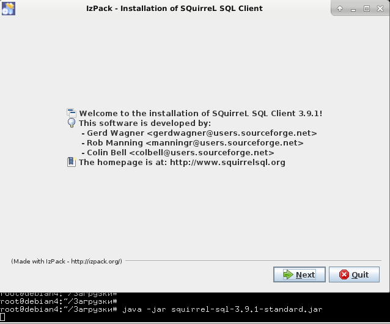
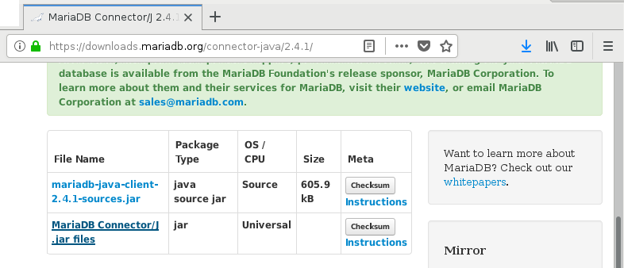
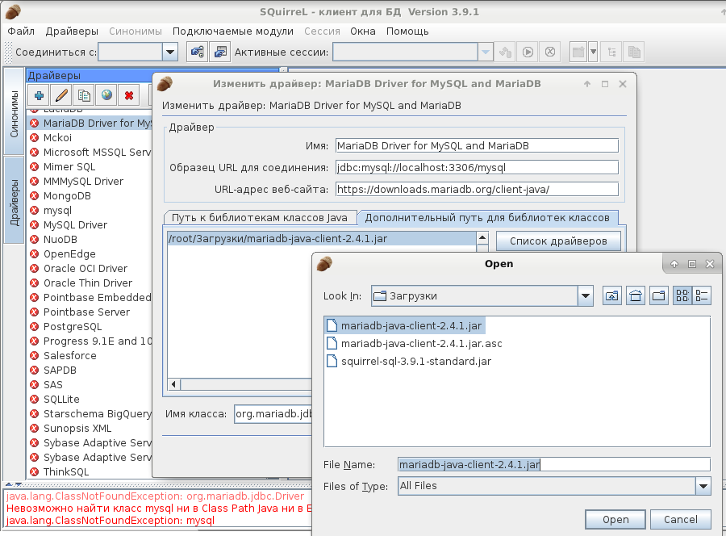
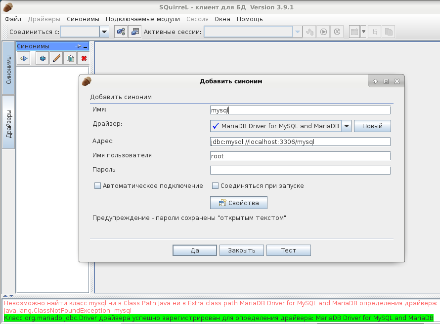

# Установка и подготовка SQuirreL для работы с MySQL

SQuirreL SQL Client — платформенно-независимый клиент баз данных с графическим интерфесом, написаный на Java.
Работает с любой системой управления базами данных, поддерживающей JDBC 2.0.
Язык не поворачивается назвать SQuirreL
удобным (с прекрасным и привычным HeidiSQL мало что сравнится), но под Lunux особо выбирать не приходится
и SQuirreL уж точно комфортнее, чем стандартный mysql-клиент командной строки.

Установка SQuirreL выполнялась под Debian 9.x.

## Установка MySQL

Если вдруг MySQL еще не установлен, установим сервер и клиент:
<pre>apt-get install mysql-server mysql-client</pre>

Устанавливаем пароль для root:
<pre>mysqladmin -u root password mypass</pre>

Запускаем MySQL:
<pre>service mysql start</pre>

Запускаем клиент MySQL:
<pre>mysql -u root -p</pre>
и выполняем запрос:
<pre>GRANT ALL PRIVILEGES ON *.* TO 'root'@'localhost' IDENTIFIED BY 'mypass'
WITH GRANT OPTION;
</pre>
Вместо "mypass" укажите ранее выбранный вами пароль.

Если вы случайно забудете новый пароль к root-пользователю БД, сбросить его можно с помощью последовательности команд:
<pre>service mysql stop
mysqld --skip-grant-tables --user=root
mysql -u root
</pre>
и запросов:
<pre>UPDATE mysql.user SET Password=PASSWORD('mynewpass') WHERE User='root';
FLUSH PRIVILEGES;
</pre>

## Установка SQuirreL

Заходим на сайт squirrel-sql.sourceforge.net и скачиваем по указанным там ссылкам последнюю версию SQuirreL.
Я воспользовалась актуальной на текущий момент ссылкой: 
<a href="https://sourceforge.net/projects/squirrel-sql/files/3-snapshots/snapshot-20181209_2128/squirrel-sql-snapshot-20181209_2128-standard.jar/download" rel="nofollow">https://sourceforge.net/projects/squirrel-sql</a>.

Запускаем скачанный файл на выполнение:
<pre>java -jar squirrel-sql-3.9.1-standard.jar</pre>

Появится стандартное окно установки:

После того, как SQuirreL установлен, надо запустить приложение и перейти во вкладку со списоком драйверов.

Все драйвера в списке будут помечены красным крестиком. Это вам не HeidiSQL. Программа установлена, но пользоваться ей нельзя. Требуются дополнительные страдания.

Выбираем драйвер MariaDB и переходим в его настройки. Нам необходимо скачать коннектор. Возможно, в параметрах драйвера, в поле "URL-адрес веб-сайта" уже есть адрес, по которому вам только останется перейти.

Скачиваем коннектор. В настройках драйвера переходим на вкладку "Дополнительный путь для библиотек классов", нажимаем кнопку "Добавить", в открывшемся диалоговом окне ищем скачанный коннектор, выбираем его. Нажимаем кнопку "Список драйверов" и в поле "Имя класса" появится значение. Сохраняем все настройки для чего нажимаем "Да".

Окно настроек драйвера закроется и появится надпись **"Класс org.mariadb.jdbc.Driver драйвера успешно зарегистрирован для определения драйвера: MariaDB Driver for MySQL and MariaDB"**.

## Подключение к БД MySQL с помощью SQuirreL

Создаем синонимы. На самом деле, задаем настройки подключения, почему вкладка называется "синонимы" - не понятно.

При попытке подключения к БД я столкнулась с двумя типами ошибок: **"Access denied for user"**
и **"If password has been set using other charset"**.

### Ошибка SQuirreL при подключении к БД "mysql: Access denied for user"

Текст ошибки:

*mysql: Access denied for user 'root'@'localhost'
class java.sql.SQLException: Access denied for user 'root'@'localhost'*

Решение:

<pre>GRANT ALL PRIVILEGES ON *.* TO 'root'@'localhost' IDENTIFIED BY 'pass'
WITH GRANT OPTION;
</pre>

Выполнить указанный запрос, подключившись к MySQL с помощью обычного консольного клиента.

### Ошибка SQuirreL при подключении к БД "Current charset is UTF-8. If password has been set using other charset"

Текст ошибки:

*Current charset is UTF-8. If password has been set using other charset, consider using option 'passwordCharacterEncoding'
class java.sql.SQLException: Access denied for user 'root'@'localhost' (using password: YES)
Current charset is UTF-8. If password has been set using other charset, consider using option 'passwordCharacterEncoding'*

В моем случае ошибка была вызвана не проблемами в кодировке, а банальным вводом неправильного пароля,
который я сменила в пылу борьбы с SQuirreL и забыла об этом. Однако, отсылки к проблемам с UTF-8 могут
озадачить и привести к бесполезным попыткам решить несуществующие проблемы.

