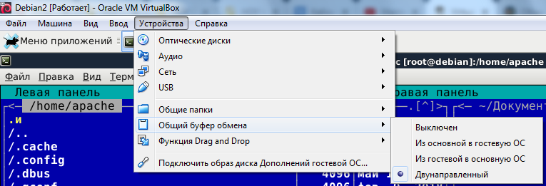
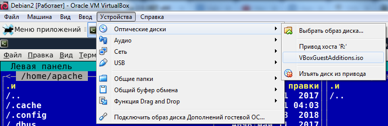

# Как настроить буфер обмена между основной системой и виртуальной машиной VirtualBox

Исходные данные: Windows 7, VirtualBox 5.2.22, виртуальная машина под Debian (это важно, т.к. судя по отзывам в интернете, те способы, которые сработают под Ubunta - для Debian не подходят).

**1.** Запускаем виртуальную машину.

**2.** После запуска идем в пункт меню <strong>"Устройства"</strong>, ищем подменю <strong>"Общий буфер обмена"</strong>. Из предложенных вариантов выбираем <strong>"Двунаправленный"</strong>.

**3.** Проверяем содержимое директории <strong>"C:\Program Files\Oracle\VirtualBox\"</strong> . Если все благополучно, вы обнаружите там образ диска <strong>"VBoxGuestAdditions.iso"</strong>.

**4.** В терминале Debian вводим команды (эти и все команды ниже выполняются под root):

<pre># apt-get update
# apt-get install build-essential
# apt-get install module-assistant
</pre>

<ul>
<li><strong>build-essential</strong> - это пакет для сборки пакетов Debian. С ним связаны пакеты: gcc, g++, make и др.</li>
<li><strong>module-assistant</strong> - предназначен для сборки некоторых модулей, загружаемых ядром при старте Linux.</li>
</ul>

Можно проверить простыми командами, установлен ли gcc:
<pre># whereis gcc
# gcc -v
</pre>
**5.** Монтируем "VBoxGuestAdditions.iso". Выбираем пункт меню **"Устройства" -&gt; "Оптические диски"**, подключаем **"VBoxGuestAdditions.iso"**.

В терминале Debian вводим команды:
<pre># mount media/cdrom
# m-a prepare
# sh /media/cdrom/VBoxLinuxAdditions.run
</pre>

**6.** Перезагружаем виртуальную машину.

