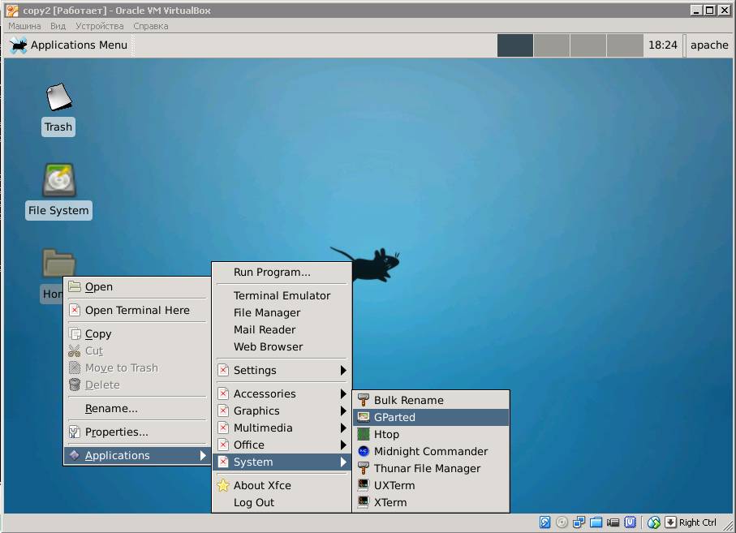
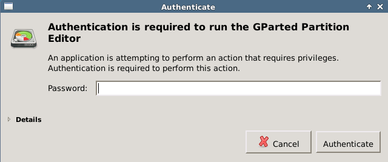
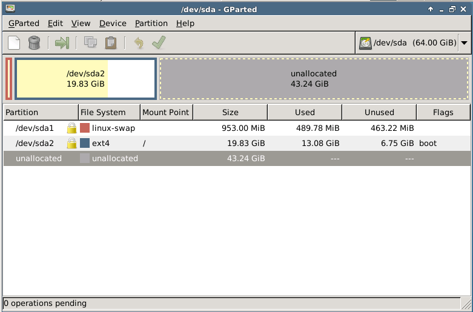
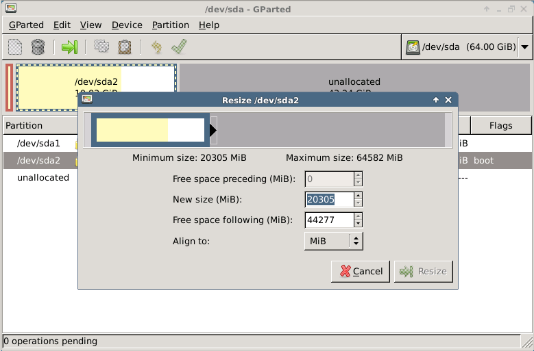

# Как увеличить размер виртуального жесткого диска в VirtualBox

**Проблема:** на виртуальной рабочей машине неожиданно закончилось свободное место. Некоторое время ситуацию
удавалось исправить, почистив логи. Но в конце концов настал тот момент, когда база данных и git-репозиторий разрослись
настолько, что чистка логов перестала помогать.
<pre>$ df
Filesystem     1K-blocks     Used Available Use% Mounted on
/dev/sda2       14274536 13281252    993284 100% /
none                   4        0         4   0% /sys/fs/cgroup
udev              250284        8    250276   1% /dev
tmpfs              50716      400     50316   1% /run
none                5120        0      5120   0% /run/lock
none              253568       72    253496   1% /run/shm
none              102400        4    102396   1% /run/user
</pre>

**Исходные данные:** виртуальная машина VirtualBox, установлена Ubuntu, под которую
выделено примерно 14 Гб. Основная операционная система: Windows XP.
<pre>$ lsb_release -a
No LSB modules are available.
Distributor ID: Ubuntu
Description:    Ubuntu 14.04.3 LTS
Release:        14.04
</pre>

В интернете приводились разнообразные советы, как изменить размер с помощью VBoxManage.exe :
<ol>
<li>Изменить размер диска с помощью VBoxManage.exe и команды <b>modifyhd</b> .
<pre>"C:\Program Files\Oracle\VirtualBox\VBoxManage.exe" modifyhd "disk1.vmdk" 
--resize 21200
</pre>
</li>

<li>Конвертировать формат vmdk в vdi, после чего vdi изменить с помощью <b>modifyhd</b>.
<pre>"C:\Program Files\Oracle\VirtualBox\VBoxManage.exe" clonehd "disk1.vmdk" 
"cloned.vdi" --format vdi --variant Standard
"C:\Program Files\Oracle\VirtualBox\VBoxManage.exe" modifyhd "cloned.vdi" 
--resize 21200
</pre>
</li>
<li>Нужно проверить свойства дисков, если в настройках дисков и образа есть "Динамически расширяющийся образ" - ничего делать не надо, т.к. он сам будет автоматически разрастаться.</li>
</ol>

Ни один из советов не привел к нужному результату. VBoxManage.exe постоянно возвращал ошибку 
**"Resize hard disk operation for this format is not implemented yet!"**:
<pre>&gt; "C:\Program Files\Oracle\VirtualBox\VBoxManage.exe" modifyhd "cloned.vdi" 
--resize 21200
0%...
Progress state: VBOX_E_NOT_SUPPORTED
VBoxManage.exe: error: Resize hard disk operation for this format is not 
implemented yet!
</pre>

В настройках моей виртуальной машины было указано, что образ действительно, "динамически расширяющийся"
<pre>&gt; "C:\Program Files\Oracle\VirtualBox\VBoxManage.exe" showhdinfo "cloned.vdi"
UUID:           31b660cc-fc73-41d4-852a-373ae4ed78d1
Parent UUID:    base
State:          created
Type:           normal (base)
Location:       C:\Documents and Settings\user\VirtualBox\VMs\
default_1438777895171_82546_copy\cloned.vdi
Storage format: VDI
Format variant: dynamic default
Capacity:       65536 MBytes
Size on disk:   15059 MBytes
</pre>
, но в реальности никакого расширения не происходило.

Ниже приведено решение, которое помогло.

## Увеличение размера жесткого диска с помощью Gparted

Этот метод поможет, если:
<ul>
<li>Образ виртуального диска имеет статус "динамически расширяющегося".</li>
<li>На реальном жестком диске есть свободное место, которое будет перераспределено в пользу
виртуального жесткого диска.</li>
</ul>

**1. Необходимо установить gparted.**
<pre>sudo apt-get install gparted</pre>

**2. Графическая оболочка для Ubuntu.**

Если увеличивать будем ubuntu-server, на котором не установлена ранее никакая графическая оболочка, нужно
установить **xfce4**. Возможности графического интерфейса нужны для запуска **gparted**. Устанавливаем **xfce4**,
потому что он весит достаточно мало (в условиях уже возникшей проблемы со свободным местом, важен каждый мегабайт)
и не требователен к ресурсам.
<pre>sudo apt-get install xfce4</pre>

Можно установить дополнительные компоненты:
<pre>sudo apt-get install xfce4-goodies</pre>

Я дополнительные компоненты не ставила - катастрофически не хватало места на диске.

Если на ubuntu уже есть графическая оболочка, она настроена и работает - можно пропустить этот шаг.

**3. Поиск свободного места для gparted и xfce4.**

Если не хватает места для установки **gparted** и **xfce4**, нужно удалить что-то из установленных пакетов.
Я пожертвовала серверами powerdns и bind.

Кроме того, можно вычистить логи в директориях */var/log* и */var/logs* . Лучше проявлять осторожность, не удалять
файлы логов, а просто обнулить их содержимое:
<pre>sudo cp /dev/null syslog</pre>

**5. После этого запускаем xfce4.**
<pre>startxfce4</pre>

**6. Запускаем gparted.**
<pre>sudo gparted</pre>

**Gparted** потребует ввести пароль от вашей учетной записи:

Выбираем нужный раздел из приведенного списка, после этого ищем в меню "Изменить размер/Переместить" или просто нажимаем на жирную зеленую стрелку вправо, на панели инструментов.

Указываем новый размер диска. Нажимаем кнопку "Resize". После возвращения к списку дисков, находим на панели инструментов кнопку "Apply All Operations" и нажимаем ее. После этого система наконец-то увеличит объем свободного пространства.

Следует учитывать, что сохранность данных на диске не гарантируется, желательно перед внесением изменений сделать копию. Я не стала копировать данные, просто предварительно клонировала виртуальную машину, сохранив, таким образом не только данные, но и все настройки рабочей среды.

