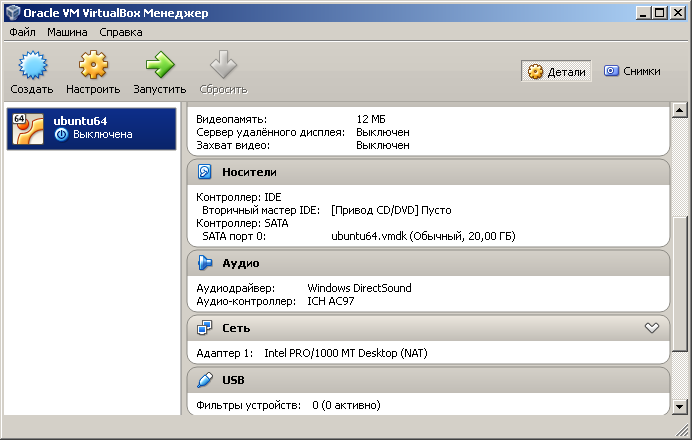
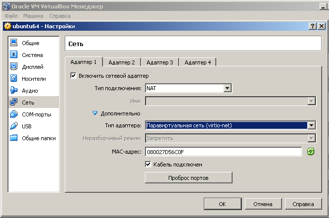
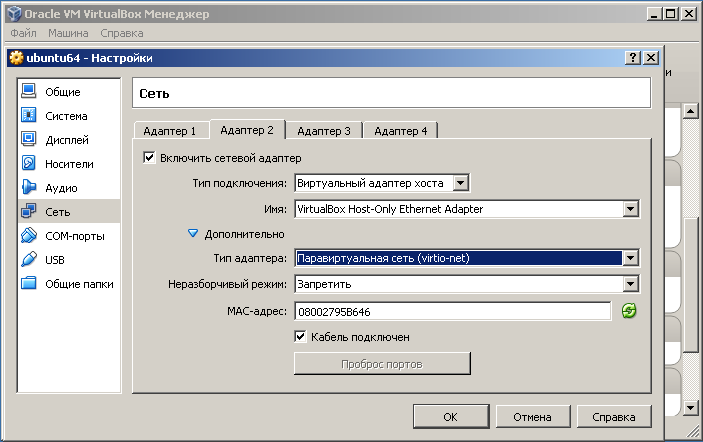
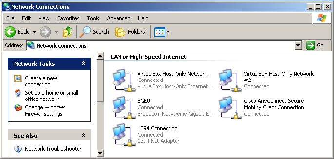
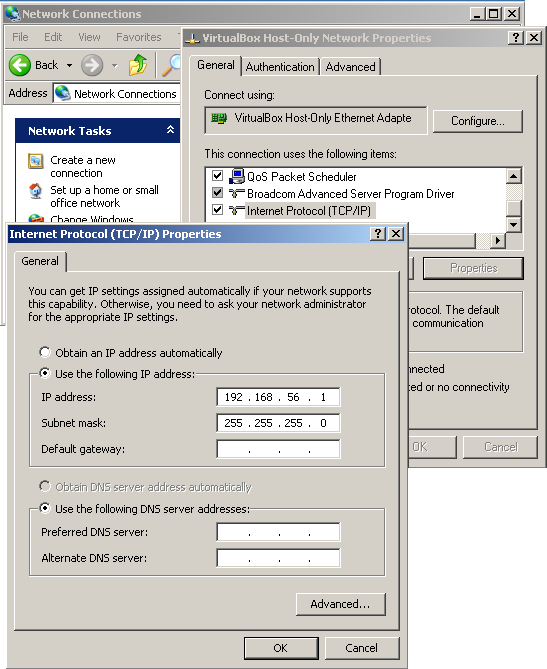
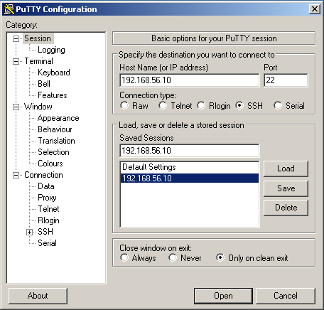
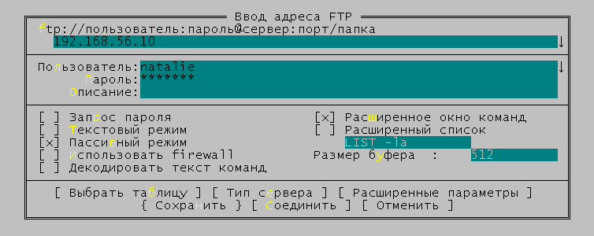

# Настройка сети на гостевой ОС в VirtualBox (ssh, ftp)

<ul>
<li>Базовая система: Windows XP</li>
<li>VirtualBox v.4.3</li>
<li>Гостевая OS: Ubuntu 16.04 LTS xenial</li>
</ul>

На виртуальную машину была установлена Ubuntu. Сразу после этого потребовалось настроить к ней ssh-доступ (для
более удобного взаимодействия).

Виртуальная машина используется только для "домашних" исследований и обучения. Поэтому, аспекты безопасности при
настройке ssh и ftp не рассматриваются.

## Как настроить ssh-доступ

Настройки сети по умолчанию, созданные при установке системы:

Выбираем виртуальную машину и нажимаем кнопку "Настроить". Изменяем настройки у первого сетевого адаптера. Вместо "Intel PRO" в поле "Тип адаптера" указываем "virtio-net".

Добавляем второй сетевой адаптер. На вкладке "Адаптер 2" устанавливаем флаг "Включить сетевой адаптер", в поле "Тип подключения" выбираем "Виртуальный адаптер хоста", в поле "Имя" выбираем "VirtualBox Host-Only Ethernet Adapter".

"Virtio-net" - это специальный тип сетевого адаптера. Эмуляцию сетевого устройства в гостевой системе будет обеспечивать драйвер "virtio". Преимущество использования в увеличении производительности сетевого ввода/вывода.

Можно пойти в настройки сети на основном компьютере, и поинтересоваться, что прописано в свойствах выбранного сетевого адаптера:

Далее, запускаем виртуальную машину. Необходимо настроить дополнительный сетевой интерфейс. Изучаем текущую ситуацию:
<pre>$ ifconfig
enp0s3    Link encap:Ethernet  HWaddr 08:00:27:d5:6c:0f
          inet addr:10.0.2.15  Bcast:10.0.2.255  Mask:255.255.255.0
          inet6 addr: fe80::a00:27ff:fed5:6c0f/64 Scope:Link
          UP BROADCAST RUNNING MULTICAST  MTU:1500  Metric:1
          RX packets:64670 errors:0 dropped:0 overruns:0 frame:0
          TX packets:21653 errors:0 dropped:0 overruns:0 carrier:0
          collisions:0 txqueuelen:1000
          RX bytes:93952418 (93.9 MB)  TX bytes:1180832 (1.1 MB)

lo        Link encap:Локальная петля (Loopback)
          inet addr:127.0.0.1  Mask:255.0.0.0
          inet6 addr: ::1/128 Scope:Host
          UP LOOPBACK RUNNING  MTU:65536  Metric:1
          RX packets:160 errors:0 dropped:0 overruns:0 frame:0
          TX packets:160 errors:0 dropped:0 overruns:0 carrier:0
          collisions:0 txqueuelen:1
          RX bytes:11840 (11.8 KB)  TX bytes:11840 (11.8 KB)
</pre>
Смотрим доступные сетевые интерфейсы:
<pre>$ ifconfig -a
enp0s3    Link encap:Ethernet  HWaddr 08:00:27:0d:17:fc
          ...

enp0s8    Link encap:Ethernet  HWaddr 08:00:27:11:ec:0c
          ...

lo        Link encap:Локальная петля (Loopback)
          ...
</pre>

Открываем файл */etc/network/interfaces* :
<pre>$ sudo mcedit /etc/network/interfaces</pre>

На старых Ubuntu настройки выглядели бы примерно так:
<pre>auto eth1
iface eth1 inet static
    address 192.168.56.10
    netmask 255.255.255.0
</pre>

В новых версиях Ubuntu используются другие названия сетевых интерфейсов, например:
<ul>
<li>enp0s3 вместо eth0</li>
<li>wlp3s0 вместо wlan0</li>
</ul>

Вносим правки, в результате получается что-то вроде этого:
<pre>source /etc/network/interfaces.d/*

auto lo
iface lo inet loopback

auto enp0s3
iface enp0s3 inet dhcp

auto enp0s8
iface enp0s8 inet static
    address 192.168.56.10
    netmask 255.255.255.0
</pre>

Перезапускаем систему. На данном этапе уже можно попробовать выполнить **ping** из командной строки основной системы:
<pre>C:\...ings\Administrator\My Documents\Work\dev-lab.info&gt;ping 192.168.56.10

Pinging 192.168.56.10 with 32 bytes of data:

Reply from 192.168.56.10: bytes=32 time&lt;1ms TTL=64
Reply from 192.168.56.10: bytes=32 time&lt;1ms TTL=64
Reply from 192.168.56.10: bytes=32 time&lt;1ms TTL=64

Ping statistics for 192.168.56.10:
    Packets: Sent = 3, Received = 3, Lost = 0 (0% loss),
Approximate round trip times in milli-seconds:
    Minimum = 0ms, Maximum = 0ms, Average = 0ms
Control-C
^C
</pre>

Вывод **ifconfig** после перезагрузки гостевой ОС:
<pre>$ ifconfig
enp0s3    Link encap:Ethernet  HWaddr 08:00:27:0d:17:fc
          inet addr:10.0.2.15  Bcast:10.0.2.255  Mask:255.255.255.0
          inet6 addr: fe80::a00:27ff:fe0d:17fc/64 Scope:Link
          UP BROADCAST RUNNING MULTICAST  MTU:1500  Metric:1
          RX packets:16 errors:0 dropped:0 overruns:0 frame:0
          TX packets:23 errors:0 dropped:0 overruns:0 carrier:0
          collisions:0 txqueuelen:1000
          RX bytes:2240 (2.2 KB)  TX bytes:2230 (2.2 KB)

enp0s8    Link encap:Ethernet  HWaddr 08:00:27:11:ec:0c
          inet addr:192.168.56.10  Bcast:192.168.56.255  Mask:255.255.255.0
          inet6 addr: fe80::a00:27ff:fe11:ec0c/64 Scope:Link
          UP BROADCAST RUNNING MULTICAST  MTU:1500  Metric:1
          RX packets:283 errors:0 dropped:0 overruns:0 frame:0
          TX packets:291 errors:0 dropped:0 overruns:0 carrier:0
          collisions:0 txqueuelen:1000
          RX bytes:24985 (24.9 KB)  TX bytes:42405 (42.4 KB)

lo        Link encap:Локальная петля (Loopback)
          inet addr:127.0.0.1  Mask:255.0.0.0
          inet6 addr: ::1/128 Scope:Host
          UP LOOPBACK RUNNING  MTU:65536  Metric:1
          RX packets:160 errors:0 dropped:0 overruns:0 frame:0
          TX packets:160 errors:0 dropped:0 overruns:0 carrier:0
          collisions:0 txqueuelen:1
          RX bytes:11840 (11.8 KB)  TX bytes:11840 (11.8 KB)
</pre>

Далее необходимо установить ssh-сервер:
<pre>$ sudo apt-get install ssh</pre>

Старт ssh-сервера будет прописан в автозагрузке. Перезапускаем виртуальную машину:
<pre>$ sudo shutdown -r now</pre>

Файл настройки ssh-сервера - */etc/ssh/sshd_config* . Для начала можно обойтись настройками по умолчанию.

Управлять запуском или остановкой сервера можно с помощью команд:
<pre>$ sudo service ssh stop|start|restart|status</pre>

Теперь можно попробовать подключиться к ssh-серверу.

## Как настроить ftp-доступ

Для обмена файлами между гостевой системой и основной очень удобно использовать ftp-доступ. Устанавливаем сервер:
<pre>$ sudo apt-get install vsftpd</pre>

Конфигурационный файл ftp-сервера: */etc/vsftpd.conf* . По умолчанию права пользователя, использующего ftp - сильно ограничены. Поэтому, сразу же вношу правки:
<pre># Uncomment this to enable any form of FTP write command.
write_enable=YES
</pre>
Иначе нельзя будет копировать файлы на гостевую систему.

<pre>sudo service vsftpd restart</pre>

## Доступ к web-приложениям
Если на гостевой системе запускается веб-сервер, можно получить к нему доступ, прописав в адресной строке браузера: *http://192.168.56.10* .

Либо можно внести правки в файл *C:\WINDOWS\system32\drivers\etc\hosts* в основной системе, и добавить туда строку:
<pre>192.168.56.10	www.mysite.ru</pre>

Тогда можно будет обращаться к web-серверу, используя имя **www.mysite.ru** .

