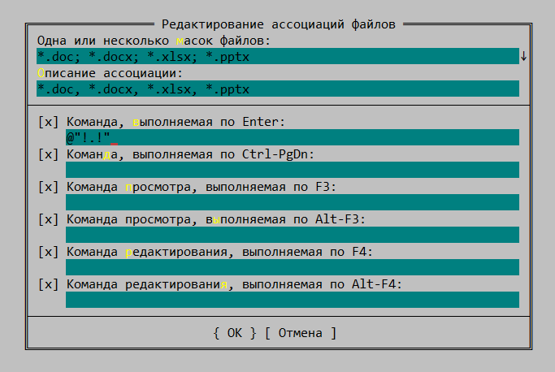

# Как открывать файлы *.doc и *.docx с помощью Far Manager 2

Far2 является практически самым главным моим рабочим инструментом под windows. Всякий раз, устанавливая его на новую систему, сталкиваюсь с небольшой, но раздражающей особенностью: при попытке открыть файл doc-формата, вместо word-редактора, far открывает его как архив.

Для исправления ситуации надо открыть меню "Команды" -&gt; "Ассоциации файлов". Нажать Insert для создания новой ассоциации.

В списке масок файлов пишем: *.doc; *.docx; *.xlsx; *.pptx .

В описании ассоциации: *.doc, *.docx, *.xlsx, *.pptx .

Команда, выполняемая по Enter: @"!.!"

Результат:

После этого можно сразу приступать к работе, перезагружать программу не обязательно.

