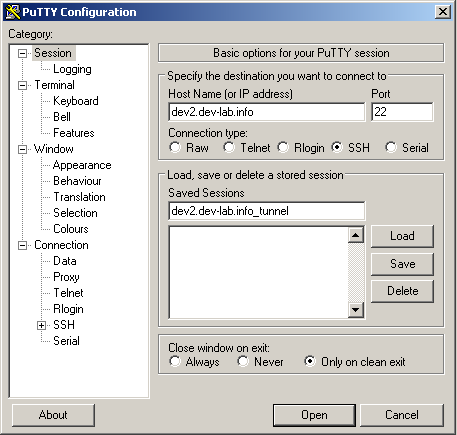
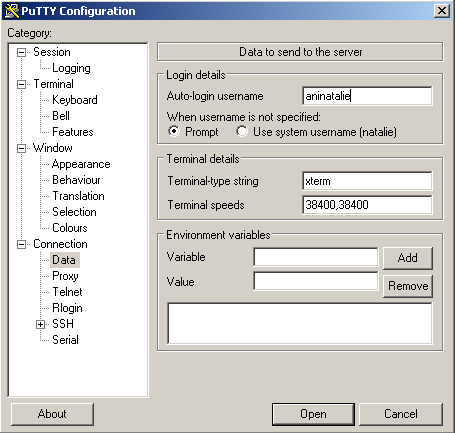
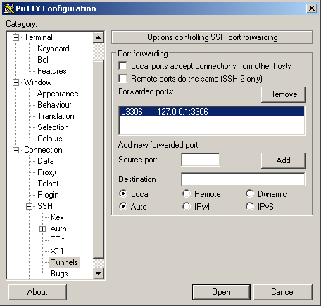
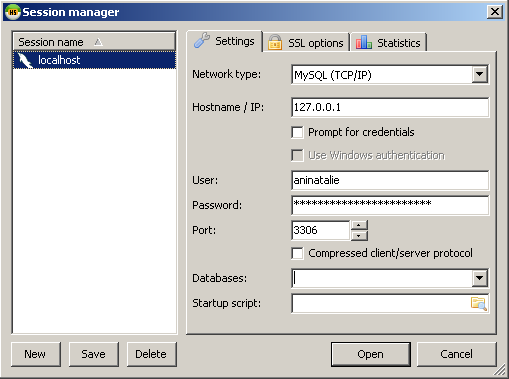
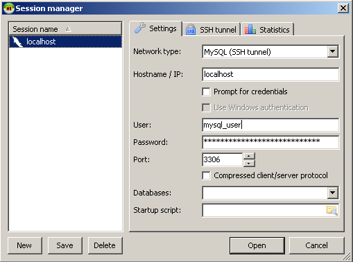
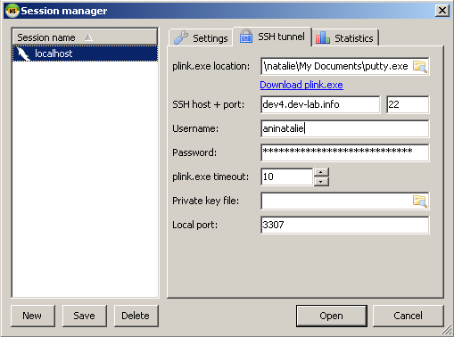

# Как подключиться к базе данных mysql через SSH-туннель

Очень неудобно работать с БД через стандартный mysql-клиент, который доступен на удаленном сервере. Часто требуется
делать сложные запросы, сравнивать результаты, быстро просматривать список таблиц - намного удобнее делать это через
клиент с графическим интерфейсом.

Однако, обычно рабочее окружение настолько защищено, что просто так, с локального компьютера, к БД не подключишься.
PhpMyAdmin на сервере тоже установлен далеко не всегда. Десктоп и графические приложения на удаленном сервере обычно
не настроены.

Хороший вариант в таком случае - использовать SSH-туннель. SSH-доступ обычно есть у каждого разработчика бекенда.
Как и при любом SSH-соединении, весь трафик между вами и БД будет шифроваться.

Ниже, в примерах, я буду использовать для подключения привычный мне mysql-клиент HeidiSQL. Однако, вы можете использовать тот клиент, который нравится вам лично.

## SSH-туннель с помощью Putty

1. Скачиваем HeidiSQL и Putty. HeidiSQL устанавливаем как обычно. Putty не требует установки, просто поместите его в ту директорию, где вам будет удобнее.

2. Запустите Putty.

3. Необходимо создать новую сессию для подключения. Для этого в поле "Host Name" укажите  имя сервера, к которому вы будете подключаться. В поле "Saved Sessions" введите произвольное имя сессии (я обычно называют сессию по имени сервера) и нажмите кнопку "Save".

4. В списке "Category" слева выберите пункт "Connection" -&gt; "Data". В поле "Auto-login username" укажите логин, который вы обычно используете для ssh-коннекта к данному серверу.

5. Перейдите в раздел "Connection" -&gt; "SSH" -&gt; "Tunnels". В поле "Source Port" введите "3306", в поле "Destination" — "127.0.0.1:3306" и нажмите кнопку "Add".

6. Вернитесь в раздел "Sessions" и еще раз нажмите кнопку "Save".

7. Устанавливаем соединение с сервером. Нажмите кнопку "Open". Сервер попросит ввести пароль — введите тот, который вы обычно используете для SSH. Если все сделано правильно, вы увидите приглашение сервера.

8. Запускаем HeidiSQL. Создаем новую сессию с помощью кнопки "New". В качестве имени сервера БД используем "127.0.0.1", логины и пароли те, какие вы обычно используете для подключения к указанной БД.

9. Сохраняем сессию, нажимаем кнопку "Open". Если подключение было выполнено успешно - вы увидите список баз данных.

## SSH-туннель с помощью HeidiSQL и Putty

Данный вариант отличается от первого тем, что настройки SSH-доступа задаются непосредственно в mysql-клиенте. Кроме того, в первом случае, можно использовать любой графический mysql-клиент, не обязательно HeidiSQL.

1. Скачиваем и устанавливаем HeidiSQL, Putty.

2. Запускаем HeidySQL. Нажимаем кнопку "New" и создаем новую сессию, имя можно выбрать произвольное.

3. Во вкладке "Settings" выполняем настройки. В поле "Network type" в выпадающем списке выбираем "MySQL (SSH tunnel)". В поле "Hostname / IP" указываем "localhost". Указываем логин и пароль, которые обычно используются для подключения к БД mysql. Номер порта по умолчанию "3306" - оставляем без изменений.

4. Переходим во вкладку "SSH tunnel". В поле "plink.exe location" указываем путь к Putty. Можно, если есть желание, скачать plink.exe, но Putty будет вполне достаточно. Далее указываем стандартные настройки SSH-доступа: адрес хоста, логин, пароль. Номер порта по умолчанию "3307" оставляем без изменений.

5. Нажимаем кнопку "Save".

6. Затем нажимаем "Open". Если все было сделано правильно, HeidiSQL выведет список баз данных на сервере.

